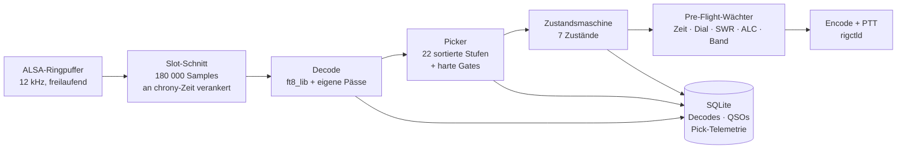
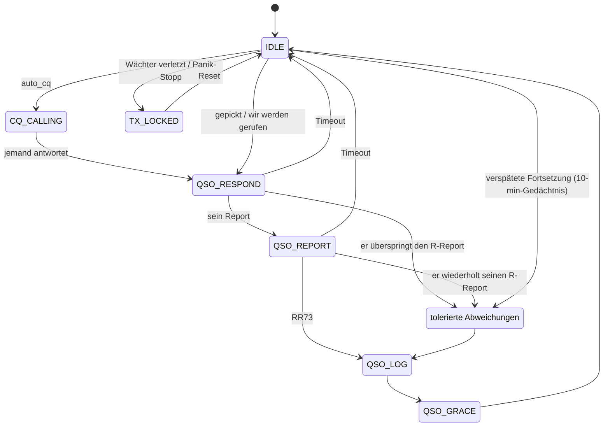

# FT8 Raspi Appliance

[🇬🇧 English](README.md) · **🇩🇪 Deutsch**

[](LICENSE)

Headless FT8/FT4-Stationssteuerung für einen Raspberry Pi 5, zwischen einem
Icom IC-705 / IC-7300 und der Welt, komplett über den Handy-Browser bedient.
**Ersetzt WSJT-X** für portablen Betrieb: gleiche Decoder-Güte, dazu die
Betriebsentscheidungen, die ein Mensch zwischen den Decodes trifft — wen
anrufen, auf welcher NF-Frequenz antworten, wann aufgeben, und wie man ein QSO
zu Ende bringt, dessen Partner sich nicht ans Protokoll hält.

Jede dieser Entscheidungen wird mit ihrem Ausgang protokolliert, und die Regeln
werden aus diesen Zahlen abgeleitet statt aus dem Bauch. Diese Rückkopplung ist
das eigentliche Thema dieses Repositorys.

Operatoren: **DK9XR** (primär), **DO3XR** (sekundär, Multi-Op).


---

## Die 15-Sekunden-Schleife

FT8 läuft in harten 15-s-Slots. Alles Folgende muss in einen davon passen, und
zwar jedes Mal — auf einem Pi 5, der nebenbei eine Web-Oberfläche ausliefert
und mit dem Rig spricht.



Eng wird es zwischen Decode und PTT: Die Sendeentscheidung muss vor der
nächsten Slot-Grenze stehen. Den *vollen* Decoder statt eines billigen
Schnelldurchgangs in dieses Fenster zu bekommen, war die mit Abstand größte
Verbesserung bei der Zahl beantwortbarer Stationen — er kostet dafür 0,5 bis
1,0 s, und die Sendung geht entsprechend spät raus. Seit dem 11.09.2026 kann
der Decoder deshalb wahlweise schon **vor** der Slot-Grenze anlaufen:
FT8-Sendungen enden nach 12,64 s, eine pünktliche Station ist also längst
vollständig im Ringpuffer (`docs/flags.md`).

## Decoder-Kette

Drei Stufen, alle gegen die WSJT-X-Referenzaufnahmen aus `ft8_lib` gemessen
(`scripts/bench_decoder_corpus.py`):

| Stufe | Was es ist | Anteil der WSJT-X-Decodes |
|---|---|---|
| `ft8_lib` original | Kārlis Gobas Codec, unverändert | 73 % |
| + eigene Pässe | kohärentes Subtract-and-rerun, OSD, Analysefenster je Pass, Fein-Sync-Demodulation | 88 % |
| + `jt9`-Stufe | WSJT-X' eigener Decoder als dritte Stufe auf demselben Audio | 98 % + ~50 Decodes, die der Referenz selbst fehlen |

Auf dem Pi 5 kostet der volle Modus **1,0 s** je Slot (2,2 s vor dem
Parallel-Umbau; 0,2–0,7 s im Echtbetrieb, der dünner ist als die dichten
Testaufnahmen). Genau das erlaubt es, ihn *vor* der Sendeentscheidung laufen zu
lassen. Sprengt ein dichter Slot das Budget dreimal hintereinander, fällt die
Box von selbst auf die alte Zweiteilung zurück.

## Was an der Umsetzung interessant ist

### Deterministische Parallelisierung

Die Kandidatenschleife des Decoders läuft auf allen vier Kernen, aber nur ihr
rein lesender Teil — LLR-Berechnung, Belief Propagation, OSD, Fein-Sync. Jeder
Thread schreibt ausschließlich nach `res[Kandidatenindex]`; alles, was
gemeinsamen Zustand berührt (Subtraktionspuffer, Decode-Liste, Hash-Tabellen),
bleibt seriell und in Kandidatenreihenfolge.

Die Ausgabe ist deshalb **bit-identisch, unabhängig von der Threadzahl** — das
ist keine Behauptung, sondern ein Test: `scripts/decoder_golden.py` friert
jede Nachricht, jede Metrik, jedes `via_osd`/`via_refine`-Flag und die
Reihenfolge über alle fünf Decoder-Modi ein und vergleicht Feld für Feld. Ein
paralleler Decoder, der „ungefähr dieselben Nachrichten“ findet, wäre hier
wertlos: Die Stufenreihenfolge des Pickers hängt an der Decode-Reihenfolge,
Nichtdeterminismus würde jede A/B-Messung entwerten.

### Die Zustandsmaschine muss ein Protokoll aushalten, an das sich niemand hält

Der FT8-Ablauf besteht aus sechs Durchgängen. In der Praxis überspringen
Partner Schritte, wiederholen sich und melden sich wieder, nachdem man
aufgegeben hat. Eine Zustandsmaschine, die nur die eine erwartete Nachricht
annimmt, lässt das QSO stillschweigend fallen — und sieht hinterher nicht
einmal falsch aus: Im Protokoll steht *Gegenstation verstummt*, dabei haben
wir aufgehört zu antworten.



Die Kanten in *tolerierte Abweichungen* kamen erst nach dem Abgleich der
Maschine gegen das WSJT-X-QEX-Zustandsdiagramm hinzu — fünf Lücken insgesamt,
weil die *verspätete Fortsetzung* sowohl einen späten R-Report als auch ein
spätes RR73 abdeckt, jeweils aus IDLE und aus CQ_CALLING. Getragen werden sie
von `ctx.recent_qso_ctx`, einem 10-Minuten-Gedächtnis abgebrochener QSOs:
Meldet sich der Partner nach unserem Timeout doch noch, wird der Faden mit dem
ursprünglichen Rapport wieder aufgenommen statt neu begonnen.

Was ihr Fehlen gekostet hat, über sieben Tage gemessen: 16 Stationen schickten
uns eine Bestätigung, aus der nie ein QSO wurde, eine davon 186-mal
wiederholt. Für die Gegenstelle war das jeweils eine fertige Verbindung, bei
uns eine fehlende.

Einzelheiten und Prüfprotokoll: [docs/wsjtx_qso_state_audit.md](docs/wsjtx_qso_state_audit.md).

### Jede Regel trägt eine Zahl

Jede Sendeentscheidung schreibt eine `pick_attempt`-Zeile: die entscheidende
Stufe, den Ausgang (`completed` / `went_silent` / `picked_another` / …), unsere
Signalstärke beim DX laut PSK Reporter, Entfernung, Bandbelegung und welchen
Arm der Antwortfrequenz-A/B-Test gezogen hat. `scripts/qso_bilanz.py` liest das
zurück.

Das hält die Funktionsliste ehrlich. Messergebnisse, die den Code geändert
haben:

- Ziele unter −13 dB kommen zu 4,4 % zum Abschluss, über −10 dB zu 24,8 % →
  schwache Ziele nur noch mit Empfangsbeleg aus dem PSK Reporter.
- Der Tail-End-Hunter blieb hinter seinem Rang zurück → unter den
  SNR-Stichentscheid herabgestuft statt gelöscht.
- Die Wunschliste erreichte den Picker nie: Seltenes DX ist per Definition
  schwach *und* umlagert, also griffen alle Sparregeln gleichzeitig bei genau
  den Stationen, für die man die Liste anlegt. Z68PX: 74 Decodes, null
  Versuche.
- Ein NF-Frequenzfilter wies Rufer am Bandrand ab, obwohl sein Grund (dort zu
  senden) entfallen war, als die Antwortfrequenz frei wählbar wurde. 1018
  CQ-Rufe von 161 Stationen in fünf Tagen, darunter J38DX auf 2921 Hz.
- Und das unbequeme Ergebnis: In **91 % aller Picks stand genau ein zulässiger
  Kandidat zur Wahl.** Die aufwendige 22-stufige Sortierung entscheidet etwa
  jeden zehnten Anruf; die binären Gates entscheiden jeden einzelnen.

Jedes Gate ist ein Konfigurationsschalter, und [docs/flags.md](docs/flags.md)
hält zu jedem die Zahlen fest, die ihn begründet haben.

### Wächter

Pre-Flight vor jedem PTT: chrony synchron mit |Offset| < 0,5 s (ein GPS-Fix
allein zählt nicht), Rig-Snapshot jünger als 60 s, Dial innerhalb ±500 Hz
einer konfigurierten FT8/FT4-Frequenz, Antenne deckt das Band, Leistung unter
der bandbezogenen Grenze der Lizenzklasse des Operators, SWR- und ALC-Wächter,
die nur während eigener Sendungen messen. Eine Verletzung verweigert die
Sendung und setzt ein Alarmzeichen; der Panik-Stopp kappt PTT und sperrt den
Sender bis zum Reset.

Datensicherheit: atomare Konfigurationsschreibvorgänge mit `.bak` + fsync,
WAL-SQLite mit Busy-Timeout, QSO-Log-Spill in eine Datei samt Alarm, falls ein
DB-Schreibvorgang je fehlschlägt, tägliches Backup, Geheimnisse aus den
API-Antworten entfernt.

## Alles Weitere, in Kürze

**Picker** — 22 per Drag-and-drop sortierbare Stufen (Pile-Up-Vermeidung,
Tail-End, Grayline, aus der eigenen QSO-Historie gelernte Soft-Blacklist,
Bandbedingungen, Buddy-seen, abgestuftes `psk_snr`, DXCC-Rarity, 5BWAS, VUCC)
plus harte Gates für Slot-Parität, DT-Fenster und NF-Bandränder.
**Antwortstrategie** — Antwort im ruhigsten Bin mit laufendem A/B gegen die
Rufer-Frequenz, adaptiver CQ-Rückfall, lernender Kontinent-Prior, Sperrfristen
je Rufzeichen.

**Multi-Operator** — zwei Profile mit getrennten QRZ-/Club-Log-Zugängen,
Logbuch-Ansichten und lizenzabhängigen Leistungsgrenzen. **Logbuch** —
offline-toleranter, idempotenter Upload zu QRZ.com und Club Log, lokale SQLite
als führende Quelle, ADIF-Stapelexport für Operatoren ohne ClubLog-Schlüssel.

**CEPT / Ausland** — GPS-Landeserkennung an echten Grenzpolygonen,
Präfix-Vorschlag, und wo deutsche Klasse A bzw. Klasse E ohne Gastlizenz
arbeiten darf. **Alarmierung** — ntfy-Push für Wunsch-DX (automatisch aus dem
NG3K-ADXO-Kalender) und für Gewitter innerhalb eines einstellbaren Radius.
**Durchgehend zweisprachig** — Oberfläche, Backend-Meldungen und Push-Texte,
drei CI-Prüfungen halten die Kataloge synchron. **Selbst-Update** — holt
getaggte Releases alle 10 min, beendet erst das laufende QSO, prüft nach dem
Neustart die Gesundheit und rollt bei Fehlern zurück.

## Repo-Aufbau

Vollständige Spezifikation: [architecture.md](./architecture.md)

```
backend/         Python 3.12 + FastAPI-Controller, ft8_lib über cffi
frontend/        Svelte 5 + Vite Single-Page-App (mobile-first)
vendor/ft8_lib/  Kārlis Gobas FT8/FT4-Codec (Git-Submodul, MIT)
deploy/          systemd-Units, NetworkManager, hostapd, chrony, install.sh
data/            cty.dat (Offline-DXCC), Kartenkacheln, Marinefunker, dxcc_rarity
docs/            Audits, Decoder-Entwicklung, Flag-Begründungen, Betrieb
scripts/         Release, Selbst-Update, Messungen, Golden-Test, Telemetrie
```

Mess- und Wartungswerkzeuge, die man kennen sollte:

| Skript | Zweck |
|---|---|
| `bench_decoder_corpus.py` | Decoder-Ausbeute gegen den WSJT-X-Referenzkorpus |
| `decoder_golden.py` | Bit-Identitäts-Prüfung für jede Decoder-Änderung |
| `qso_bilanz.py` | Abschlussquoten nach Weg, PSK-Datenlage, Kandidatenzahl |
| `doc_screenshots.py` | erzeugt die Oberflächen-Screenshots neu |
| `dev_run.py` | voller Stack gegen Mock-Rig/GPS, ohne Pi |

## Schnellstart — Workstation, kein Pi nötig

```bash
git submodule update --init --recursive
cd vendor/ft8_lib && make && cd ../..

cd backend
uv venv && source .venv/bin/activate
uv pip install -e ".[dev]"
pytest                      # 1001 Tests

cd ../frontend
npm install
npm run dev                 # http://localhost:5173
```

`scripts/dev_run.py` startet den ganzen Controller gegen Mock-Hardware mit
gefülltem Logbuch — praktisch zum Durchklicken der Oberfläche. Alle nach außen
wirkenden Integrationen sind darin bewusst abgeschaltet.

## Erst-Inbetriebnahme auf einem Pi

```bash
ssh pi@<host>
git clone https://github.com/simonsorcerer23/ft8-raspi.git ~/ft8-appliance
cd ~/ft8-appliance
sudo ./deploy/install.sh
```

`install.sh` nimmt standardmäßig den ausgecheckten Repo-Pfad und den
aufrufenden sudo-Benutzer (ersatzweise den Repo-Eigentümer). Für ein eigenes
Konto oder einen abweichenden Pfad `--user USER --dir APP_DIR` mitgeben; das
Installationsskript erzeugt systemd-Units und sudoers-Regeln für genau diese
Installation und legt die Werte in `/etc/ft8-appliance/install.env` ab. Weitere
Releases kommen über `ft8-self-update.timer`. Einen davon schneidet man mit
`./scripts/release.sh vX.Y.Z`, was auch [CHANGELOG.md](./CHANGELOG.md) aus dem
Commit-Log erzeugt.

## Hardware

- **SBC:** Raspberry Pi 5 8 GB (Produktivbetrieb seit 09/2026) oder Pi 4B 8 GB.
  Der Pi 5 fährt den vollen Decoder vor der Sendeentscheidung; auf dem 4B
  bleibt die Zweiteilung (`decoder_late_pass: true`).
- **Speicher:** NVMe-SSD, direkt davon gebootet (Argon NEO 5 M.2), keine
  SD-Karte im Betrieb.
- **Funkgerät:** Icom IC-705 oder IC-7300 über ein einziges USB-Kabel
  (CAT + Audio) via `rigctld`. QMX/QMX+ experimentell.
- **Audio:** der USB-Codec im Rig, keine zusätzliche Soundkarte.
- **Auf dem Pi:** Debian-Paket `wsjtx` für die `jt9`-Stufe (installiert
  `install.sh`; ohne es bleibt die dritte Stufe schlicht aus).
- **GPS:** optional, hilft portabel bei Zeit und Locator.

## Zugänge & Datenschutz

Externe Dienste (QRZ, Club Log, ntfy, HamQTH, …) brauchen Zugangsdaten je
Operator. **Sie liegen ausschließlich in `/etc/ft8-appliance/config.yaml` auf
dem Pi** (`0600`), nie in diesem Repository. Die API entfernt alle Geheimnisse
aus ihren Antworten, die Oberfläche ist durch ein Login-Passwort geschützt.
Dienstliste: [CREDITS.md](./CREDITS.md).

## Screenshots

Aufgenommen im eingebauten Demo-Modus — alle Rufzeichen sind fiktiv
(Simulator), keine echten Dritt-Stationen. Die Oberfläche ist zweisprachig,
hier in der deutschen Voreinstellung. Die übrigen Ansichten (Logbuch,
Watchlist, Reputation, DXpedition, Blacklist, Empfänger, Band- und
Integrationskonfiguration) liegen in
[docs/screenshots/](docs/screenshots/); `scripts/doc_screenshots.py` erzeugt
den ganzen Satz neu.

<details>
<summary>Karte · Hunt-Priorität · Statistik</summary>

### Weltkarte — Decodes, Coverage-Envelope, Gray-Line, Locator-Raster


### Hunt-Priorität — die 22 frei sortierbaren Picker-Stufen


### Statistik & Steuerung — SWR-Trend, beste Zeiten, Pi-Status, TX-Controls


</details>

## Rechtlicher Hinweis

Die Station wird **besetzt** betrieben — ein Funkamateur ist da und kann sie
vom Handy anhalten. Der unbesetzte, fernbediente Betrieb (§ 13a AFuV) ist
Inhabern der Klasse A vorbehalten und an eigene Auflagen gebunden;
automatisch arbeitende Amateurfunkstellen wie Baken oder Relais brauchen eine
eigene Rufzeichenzuteilung (§§ 2, 13 AFuV). Wer das hier nachbaut, sollte sich
über die eigene Betriebsart klar sein. Keine Rechtsberatung.

## Lizenz

MIT — siehe [LICENSE](./LICENSE). Fremdkomponenten sind in
[CREDITS.md](./CREDITS.md) genannt.

## Status

Aktive Entwicklung, im Feldeinsatz auf einem einzelnen Raspberry Pi 5 8 GB,
Multi-Op (DK9XR + DO3XR auf demselben Pi). Gebaut und benutzt von einem
Vater-Sohn-Gespann aus Deutschland.

73 de DK9XR & DO3XR
