# FT8 Raspi Appliance

**🇬🇧 English** · [🇩🇪 Deutsch](README.de.md)

[](LICENSE)

Headless FT8/FT4 station controller running on a Raspberry Pi 5. Sits between
an Icom IC-705 / IC-7300 and the world, controlled entirely from a phone
browser. **Replaces WSJT-X** for portable / unattended-overseer use, with
features WSJT-X does not provide out of the box.

Operators: **DK9XR** (primary), **DO3XR** (secondary, multi-op).

---

## 📸 Screenshots

> Captured in the built-in **demo mode** — all callsigns/data are purely
> fictional (simulator), no real third-party stations.
> *(The UI is fully bilingual — live 🇩🇪/🇬🇧 toggle in the header; the
> screenshots show the German default.)*


<details>
<summary><b>Map &amp; Log</b></summary>

### World map — decodes, coverage envelope, gray-line, locator grid


### Log — with DXCC / continent / Marinefunker filters
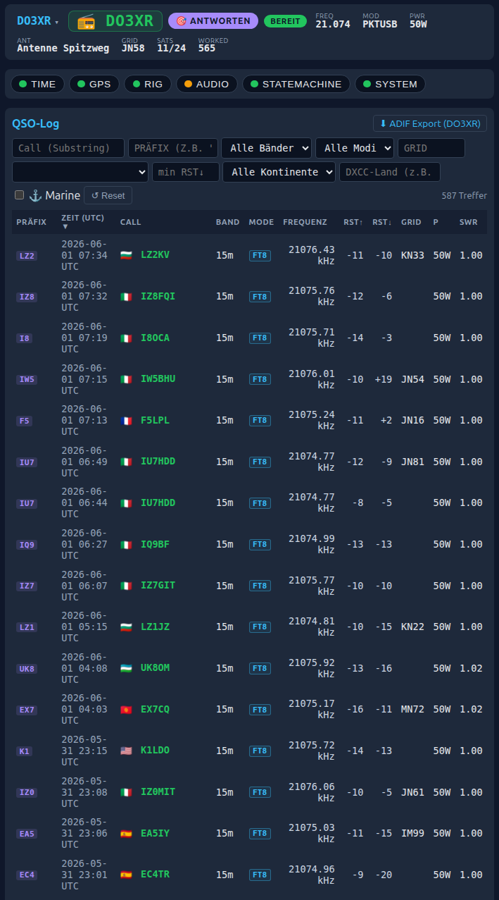

</details>

<details>
<summary><b>DX hunting</b> — watchlist · reputation · DXpedition · blacklist · who-heard-me</summary>

### Watchlist — wanted DX / DXpeditions with ntfy alert
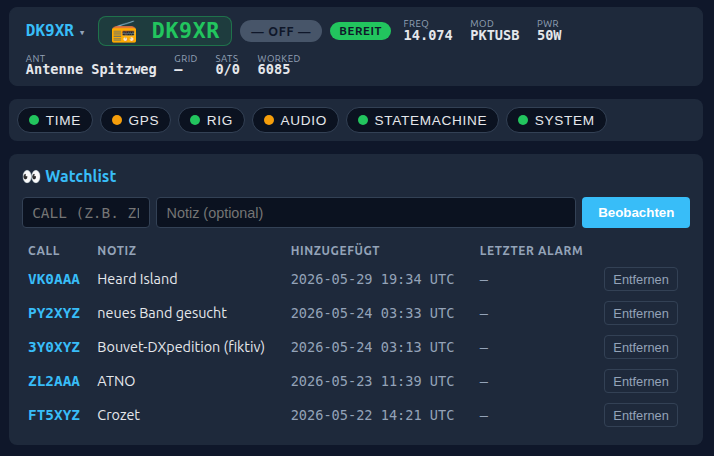

### Reputation — soft-blacklist based on station behaviour
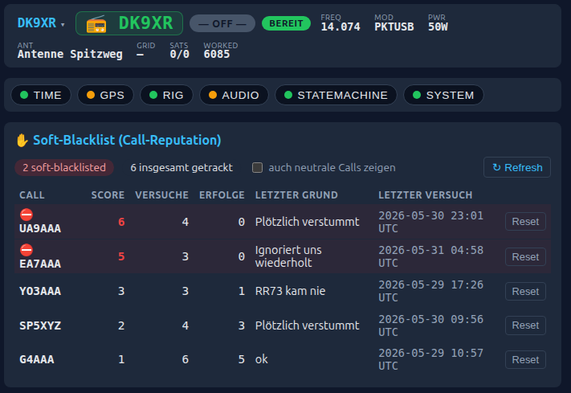

### DXpedition — NG3K calendar integration
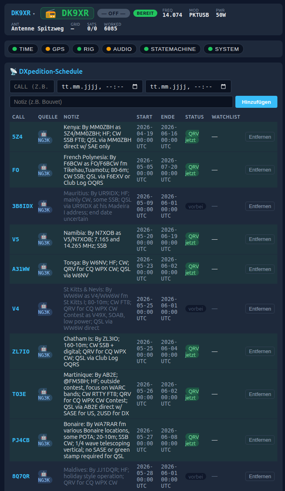

### Blacklist — manually blocked callsigns
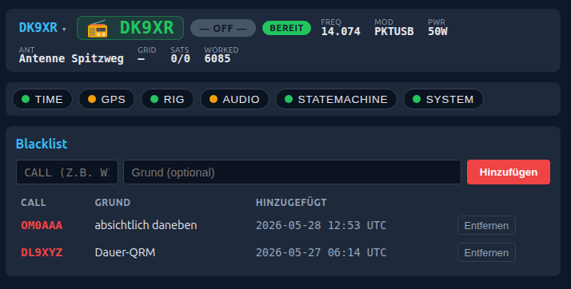

### Who-heard-me — PSK Reporter reception reports
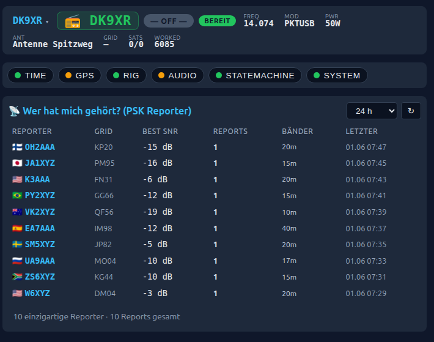

</details>

<details>
<summary><b>Stats &amp; configuration</b></summary>

### Stats &amp; controls — SWR trend, best times, Pi status, TX controls
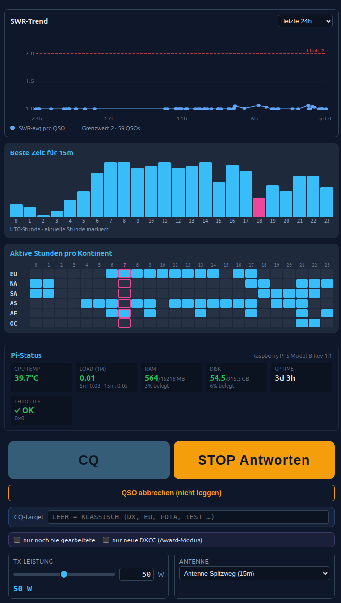

### Hunt priority — the 20 freely sortable picker tiers
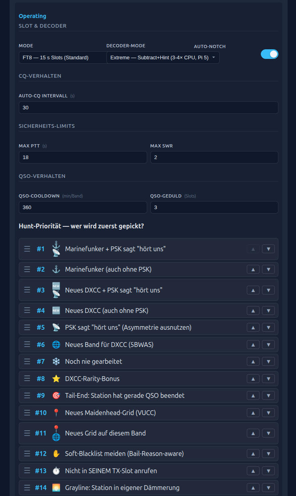

### Operators &amp; logbooks — multi-op, QRZ/ClubLog, demo toggle
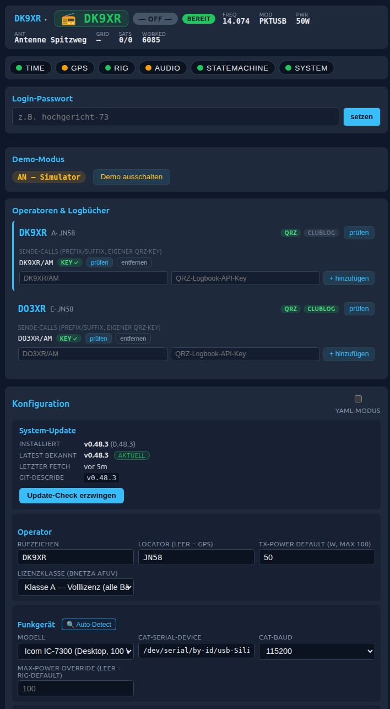

### Bands &amp; antennas
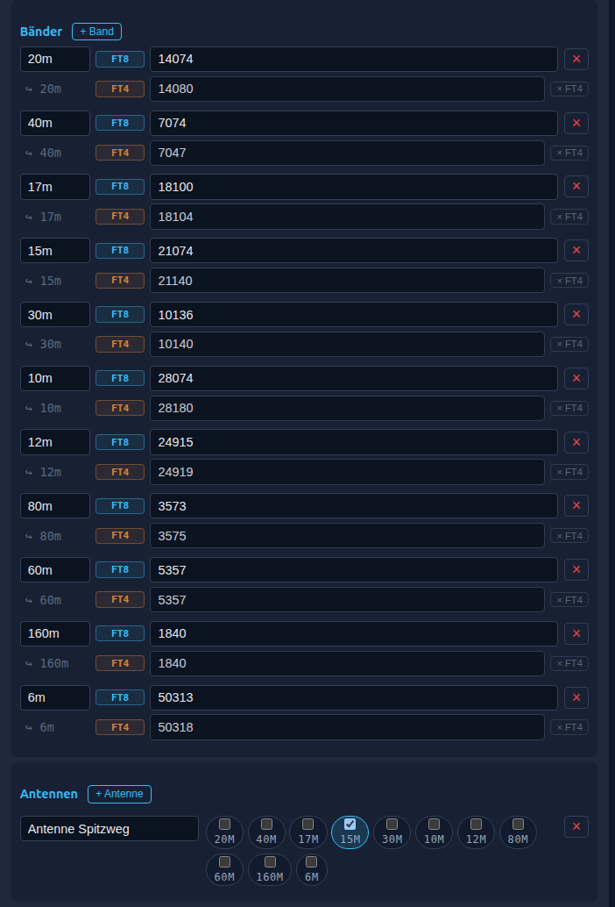

### Integrations — QRZ/ClubLog/PSK/lightning, ALC, ntfy
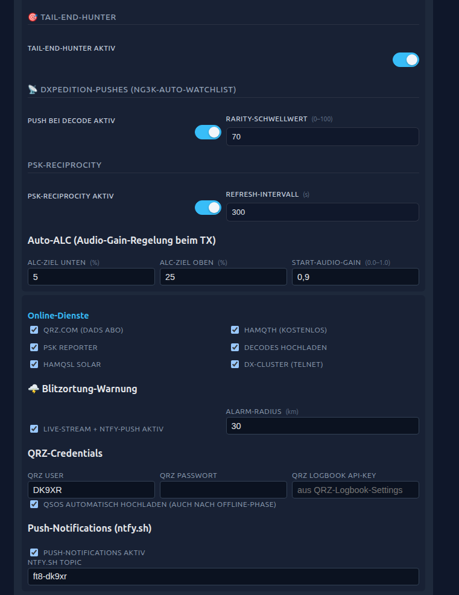

</details>

---

## Highlights

- **20-tier configurable picker** (drag-and-drop priority): pile-up
  avoidance, tail-end pickup, grayline boost, soft-blacklist learning from
  own QSO history, band-conditions awareness, buddy-seen
  (worked-on-other-band), graded `psk_snr`, DXCC rarity, 5BWAS, VUCC grid
  awards, …
- **Conservative Hunt gates** — weak single-CQ ("sole") routine picks are
  skipped unless they have award/context value or good decode/PSK SNR. After a
  poor run, a temporary strict mode requires the same evidence for routine
  targets. FT4 uses the rate profile in balanced mode; FT8 stays broader.
- **Data-driven picker tuning** — every hunt pick is logged with its outcome
  (completed / went-silent / bailed) plus context: the deciding tier, how loud
  *we* land at the DX (per PSK Reporter), SNR, distance, band occupancy, … A
  stats endpoint A/Bs it, so the tier order is tuned from real completion rates
  rather than guesswork.
- **Tail-End-Hunter** — automatic detection of `RR73`/`73` closings to grab a
  freed-up station (WSJT-X can't). Its picker rank is data-driven: telemetry
  showed it underperforms, so it now sits below the SNR tie-breaker — kept, but
  deliberately low-priority.
- **Pile-Up-Avoidance** — when ≥5 unique callers on ±50 Hz of a station, we
  skip it. Better for the band, better for the QSO rate.
- **Multi-Operator** — two profiles (e.g. you + family), each with their own
  QRZ / Club Log credentials, separate log-views, license-aware power caps.
- **Fully bilingual UI** — every screen *and* the backend / ntfy push messages
  switch live between 🇩🇪 German and 🇬🇧 English (header toggle); the docs are
  bilingual too. Three CI gates keep the DE/EN catalogs in sync and block
  hard-coded strings from creeping back in.
- **Auto-Logbook** — QSOs auto-upload to **QRZ.com** + **Club Log** in the
  background, offline-tolerant, idempotent. Local SQLite remains the source
  of truth.
- **Watchlist + ntfy push** for DXpeditions / wanted DX, auto-imported from
  the **NG3K ADXO** schedule.
- **Blitzortung lightning warning** — live WS stream, ntfy push when a
  strike lands inside a configurable radius.
- **License-aware safety** — Power cap, band lockout, SWR watchdog with
  live PTT-cut, ALC PI-loop instead of bang-bang.
- **CEPT / overseas operation** — GPS country detection via real border
  polygons (point-in-polygon, not crude rectangles), suggests the correct
  CEPT call-sign prefix, and knows where German **Klasse A vs Klasse E**
  may operate without a guest licence (DARC primary-source country list).
- **Password-protected API** — token auth on every endpoint (set a
  memorable login password from the config page); localhost is trusted so
  on-Pi tooling / self-update keep working. The ntfy lockscreen buttons use
  a separate, narrowly-scoped token.
- **Crash-safe data** — atomic config writes with `.bak` + fsync, WAL
  SQLite with busy-timeout, **QSO-log spill-to-file + alert** if a DB write
  ever fails (a completed contact is never silently lost), daily DB backup,
  telemetry retention, and secrets redacted from the API responses.
- **Self-update** — Pi pulls tagged releases from GitHub every 10 min,
  health-checks after restart, auto-rollback on failure.

## Architecture

Full spec: [architecture.md](./architecture.md)

```
backend/         Python 3.12 + FastAPI controller, ft8_lib via cffi
frontend/        Svelte 5 + Vite single-page app (mobile-first)
vendor/ft8_lib/  Kārlis Goba's FT8/FT4 codec (git submodule, MIT)
deploy/          systemd units, NetworkManager, hostapd, chrony, install.sh
data/            cty.dat (offline DXCC), map tiles, marinefunker, dxcc_rarity
docs/            Diagrams, notes, audit logs
scripts/         release.sh, self-update.sh, pi-check.sh, dev_run.py
```

## Quick-start — workstation (no Pi needed)

```bash
git submodule update --init --recursive
cd vendor/ft8_lib && make && cd ../..

cd backend
uv venv && source .venv/bin/activate
uv pip install -e ".[dev]"
pytest

cd ../frontend
npm install
npm run dev   # http://localhost:5173
```

## Initial bring-up on a Pi

```bash
ssh pi@<host>
git clone https://github.com/simonsorcerer23/ft8-raspi.git ~/ft8-appliance
cd ~/ft8-appliance
sudo ./deploy/install.sh
```

`install.sh` defaults to the checked-out repo path and the invoking sudo user
(falling back to the repo owner). For a dedicated account or non-standard path,
pass `--user USER --dir APP_DIR`; the installer renders systemd units and
self-update sudoers rules for that exact installation and stores the values in
`/etc/ft8-appliance/install.env`.

Subsequent releases roll out automatically via `ft8-self-update.timer`.
Cut a new release on the workstation with:

```bash
./scripts/release.sh vX.Y.Z
```

This also updates [CHANGELOG.md](./CHANGELOG.md) (generated from the commit
log) and writes the change list into the tag annotation. The full version
history lives in [CHANGELOG.md](./CHANGELOG.md).

## Hardware

- **SBC:** Raspberry Pi 5 (4 GB sufficient, 8 GB nicer for bigger logs)
- **Storage:** NVMe SSD recommended for the QSO database
- **Radio:** Icom IC-705 or IC-7300 via single USB cable (CAT + audio)
  through `rigctld`. QMX/QMX+ has experimental support.
- **Audio:** Onboard USB CODEC of the rig (no extra sound card)
- **GPS:** Optional, helps with time + grid locator when portable

## Credentials & privacy

External services (QRZ, Club Log, ntfy, HamQTH, …) require per-operator
credentials. **Credentials live only in `/etc/ft8-appliance/config.yaml`
on the Pi** (`0600`), never in this repository or in version control. The
API redacts all secrets from its responses, and the web UI is gated by a
login password. See [CREDITS.md](./CREDITS.md) for the full list of
integrated services.

## License

MIT — see [LICENSE](./LICENSE). Third-party components are credited in
[CREDITS.md](./CREDITS.md).

## Status

Active development. Two Pis (`ft8`, `ft8-2`) in field-shake-down. Built
and used by a father-son team of amateur radio operators in Germany.

---

# Deutsch (Kurzfassung)

Headless FT8/FT4-Steuerung auf Raspberry Pi 5 für IC-705 / IC-7300. Sitzt
zwischen Rig und Welt, Bedienung komplett übers Handy (passwortgeschützt).
**Ersetzt WSJT-X** für portablen / unbeaufsichtigten Betrieb mit Features,
die WSJT-X nicht out of the box hat — 20-Tier-Picker mit Pile-Up-Avoidance,
konservativen Hunt-Gates, datengetriebenem Tuning aus Pick-Telemetrie,
Watchlist, Auto-Upload zu QRZ +
Club Log, Gewitter-Warnung, lizenzabhängige Sicherheits-Caps, CEPT-/Ausland-
Erkennung (GPS → Land → Klasse-A/E-Regeln + Präfix-Vorschlag), bruchsicheres
QSO-Log (Spill + tägliches Backup) und Selbst-Update. **Oberfläche komplett
zweisprachig (DE/EN, live umschaltbar)** — inklusive Backend- und ntfy-Meldungen.

73 de DK9XR & DO3XR
