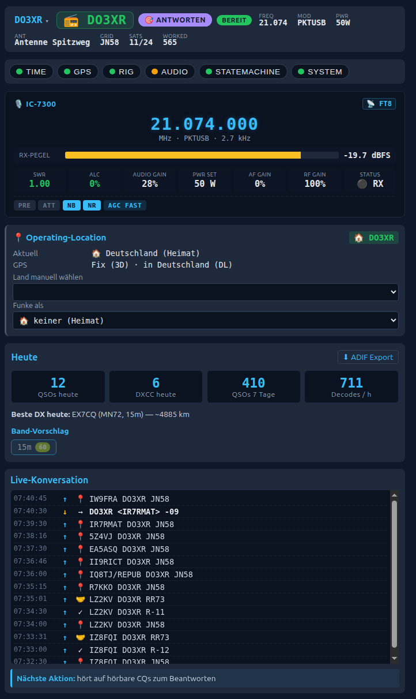
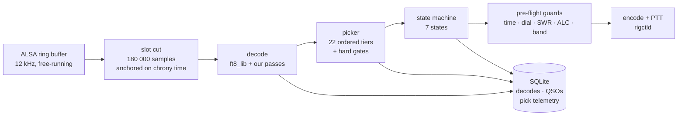
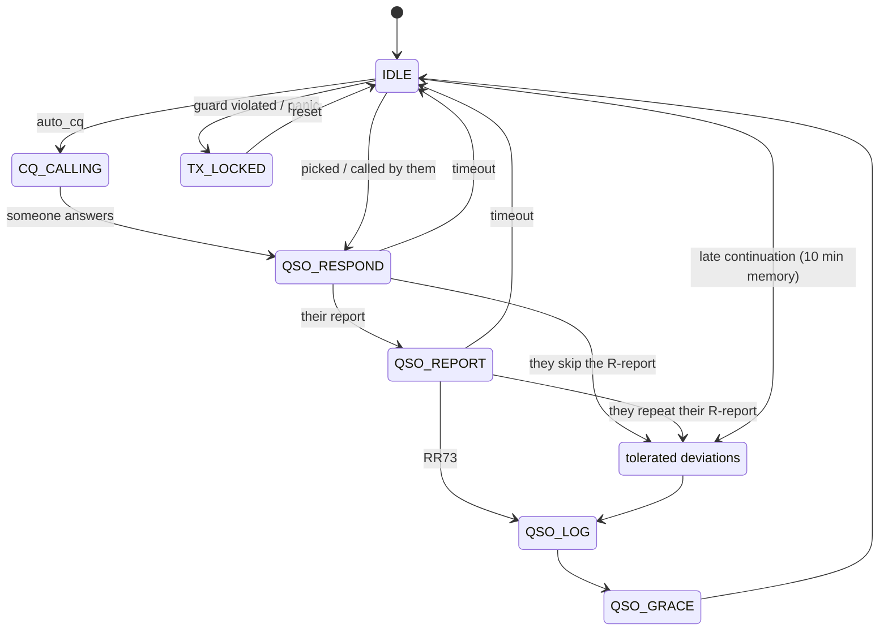
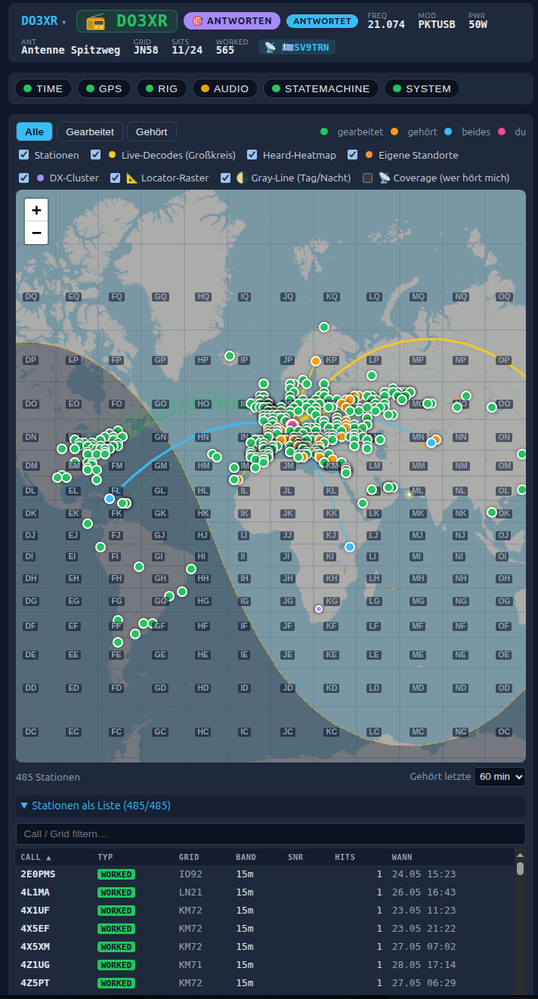
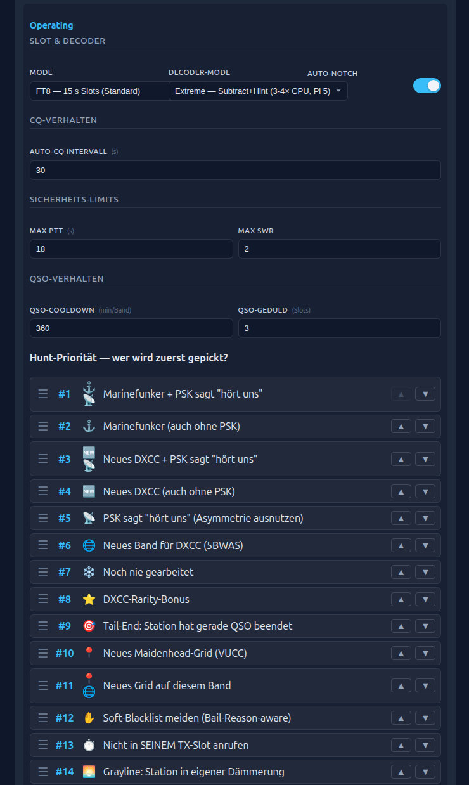
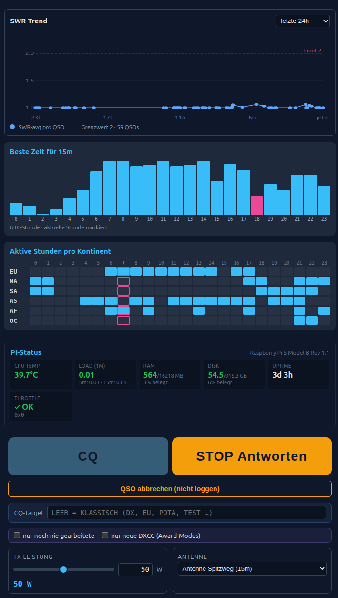

# FT8 Raspi Appliance

**🇬🇧 English** · [🇩🇪 Deutsch](README.de.md)

[](LICENSE)

Headless FT8/FT4 station controller for a Raspberry Pi 5, sitting between an
Icom IC-705 / IC-7300 and the world, driven entirely from a phone browser.
It **replaces WSJT-X** for portable operation: same decoder quality, plus the
operating decisions a human makes between the decodes — who to answer, on
which audio frequency, when to give up, and how to finish a QSO whose partner
ignores the protocol.

Every one of those decisions is logged with its outcome, and the rules are
tuned from those numbers rather than from intuition. That feedback loop is the
actual subject of this repository.

Operators: **DK9XR** (primary), **DO3XR** (secondary, multi-op).



---

## The 15-second loop

FT8 runs on hard 15 s slots. Everything below has to fit into one, every time,
on a 8 GB Pi 5 that is also serving a web UI and talking to the rig.


```mermaid
flowchart LR
    A["ALSA ring buffer<br/>12 kHz, free-running"] --> B["slot cut<br/>180 000 samples<br/>anchored on chrony time"]
    B --> C["decode<br/>ft8_lib + our passes"]
    C --> D["picker<br/>22 ordered tiers<br/>+ hard gates"]
    D --> E["state machine<br/>7 states"]
    E --> F["pre-flight guards<br/>time · dial · SWR · ALC · band"]
    F --> G["encode + PTT<br/>rigctld"]
    C --> H[("SQLite<br/>decodes · QSOs<br/>pick telemetry")]
    E --> H
    D --> H
```

The tight constraint is between decode and PTT: the transmit decision has to
be made before the next slot boundary. Getting the *full* decoder inside that
window instead of a cheap pre-pass was the single largest improvement in
answerable stations — see below.

## Decoder pipeline

Three stages, all measured against the WSJT-X reference recordings shipped
with `ft8_lib` (`scripts/bench_decoder_corpus.py`):

| Stage | What it is | Share of WSJT-X decodes |
|---|---|---|
| stock `ft8_lib` | Kārlis Goba's codec, unmodified | 73 % |
| + our passes | coherent subtract-and-rerun, OSD, per-pass analysis window, fine-sync demod | 88 % |
| + `jt9` stage | WSJT-X's own decoder as a third stage on the same audio | 98 % + ~50 decodes the reference itself lacks |

On the Pi 5 the full mode costs **1.0 s** per slot (2.2 s before the parallel
rewrite; 0.2–0.7 s in live traffic, which is thinner than the dense test
recordings). That is what lets it run *before* the transmit decision. If a
dense slot blows the budget three times running, the box falls back to the old
two-stage split by itself.

## What is interesting about the implementation

### Deterministic parallelism

The decoder's candidate loop runs on all four cores, but only its read-only
part — LLR computation, belief propagation, OSD, fine sync. Every thread
writes to `res[candidate_index]` and nothing else; everything touching shared
state (the subtract buffer, the decode list, hash tables) stays serial and in
candidate order.

The output is therefore **bit-identical regardless of thread count**, which is
not a claim but a test: `scripts/decoder_golden.py` freezes every message,
every metric, every `via_osd`/`via_refine` flag and the ordering across all
five decoder modes, and compares field by field. A parallel decoder that
"finds roughly the same messages" would be useless here — the picker's tier
order depends on decode order, so non-determinism would make every A/B
measurement meaningless.

### The state machine has to tolerate a protocol nobody follows

The FT8 exchange is six transmissions. In practice partners skip steps, repeat
themselves, and come back after you have given up. A state machine that only
accepts the one expected message silently drops the QSO — and it does not even
look wrong afterwards: the log says *station went silent*, when in fact we
stopped answering.


```mermaid
stateDiagram-v2
    [*] --> IDLE
    IDLE --> CQ_CALLING: auto_cq
    CQ_CALLING --> QSO_RESPOND: someone answers
    IDLE --> QSO_RESPOND: picked / called by them
    QSO_RESPOND --> QSO_REPORT: their report
    QSO_REPORT --> QSO_LOG: RR73
    QSO_LOG --> QSO_GRACE
    QSO_GRACE --> IDLE

    state "tolerated deviations" as tol
    QSO_RESPOND --> tol: they skip the R-report
    QSO_REPORT --> tol: they repeat their R-report
    IDLE --> tol: late continuation (10 min memory)
    tol --> QSO_LOG

    QSO_RESPOND --> IDLE: timeout
    QSO_REPORT --> IDLE: timeout
    IDLE --> TX_LOCKED: guard violated / panic
    TX_LOCKED --> IDLE: reset
```

The edges into *tolerated deviations* were added after auditing the machine
against the WSJT-X QEX state diagram — five gaps in total, since *late
continuation* covers both a late R-report and a late RR73, from either IDLE or
CQ_CALLING. They are backed by `ctx.recent_qso_ctx`, a 10-minute memory of
abandoned QSOs: if the partner reappears after our timeout, the exchange
resumes with the original report instead of starting over.

Cost of not having them, measured over seven days before the fix: 16 stations
sent us a confirmation that never became a QSO, one of them repeating it 186
times. Each of those was a complete contact on their side and a missing one on
ours.

Details and the audit trail: [docs/wsjtx_qso_state_audit.md](docs/wsjtx_qso_state_audit.md).

### Every rule carries a number

Each transmit decision writes a `pick_attempt` row: the deciding tier, the
outcome (`completed` / `went_silent` / `picked_another` / …), our SNR at the
DX per PSK Reporter, distance, band occupancy, which reply-frequency arm the
A/B picked. `scripts/qso_bilanz.py` reads it back.

This is what keeps the feature list honest. Measured results that changed the
code:

- Targets below −13 dB complete at 4.4 %, above −10 dB at 24.8 % → weak
  targets are gated behind a PSK Reporter reception report.
- The tail-end hunter underperformed its rank → demoted below the SNR
  tie-breaker instead of being deleted.
- The watchlist never reached the picker: rare DX is by definition weak *and*
  crowded, so every cost-saving gate fired at once on exactly the stations the
  list exists for. Z68PX: 74 decodes, zero attempts.
- An audio-frequency gate kept rejecting band-edge callers although the
  reason for it (transmitting there) had disappeared when the reply frequency
  became free-floating. 1018 CQs from 161 stations in five days, including
  J38DX at 2921 Hz.
- And the uncomfortable one: in **91 % of all picks there was exactly one
  eligible candidate**. The elaborate 22-tier ordering decides roughly one
  call in ten; the binary gates decide every one of them.

Every gate is a config toggle, and [docs/flags.md](docs/flags.md) records the
numbers that motivated each.

### Guardrails

Pre-flight before any PTT: chrony synced with |offset| < 0.5 s (a GPS fix
alone does not count), rig snapshot fresher than 60 s, dial within ±500 Hz of
a configured FT8/FT4 frequency, antenna covers the band, power under the
per-band cap of the operator's licence class, SWR and ALC watchdogs that only
sample during our own bursts. Violation refuses the transmission and raises an
alarm badge; a panic stop cuts PTT and locks TX until reset.

Data safety: atomic config writes with `.bak` + fsync, WAL SQLite with
busy-timeout, QSO-log spill-to-file plus alert if a DB write ever fails, daily
backup, secrets redacted from API responses.

## Everything else, briefly

**Picker** — 22 drag-sortable tiers (pile-up avoidance, tail-end pickup,
grayline, soft-blacklist learned from own QSO history, band conditions,
buddy-seen, graded `psk_snr`, DXCC rarity, 5BWAS, VUCC) plus hard gates for
slot parity, DT window and audio band edges. **Reply strategy** — quiet-bin
reply frequency with a running A/B against the caller's frequency, adaptive CQ
fallback, learning continent prior, per-callsign cooldowns.

**Multi-operator** — two profiles, separate QRZ / Club Log credentials, log
views and licence-aware power caps. **Logging** — offline-tolerant idempotent
upload to QRZ.com and Club Log, local SQLite as source of truth, ADIF batch
export for operators without a ClubLog key.

**CEPT / overseas** — GPS country detection against real border polygons,
call-sign prefix suggestion, and where German Klasse A vs Klasse E may operate
without a guest licence. **Alerting** — ntfy push for watchlist DX
(auto-imported from the NG3K ADXO schedule) and for lightning entering a
configurable radius. **Bilingual throughout** — UI, backend messages and push
notifications, with three CI gates keeping the catalogs in sync.
**Self-update** — pulls tagged releases every 10 min, finishes the running QSO
first, health-checks after restart, auto-rollback on failure.

## Repo layout

Full spec: [architecture.md](./architecture.md)

```
backend/         Python 3.12 + FastAPI controller, ft8_lib via cffi
frontend/        Svelte 5 + Vite single-page app (mobile-first)
vendor/ft8_lib/  Kārlis Goba's FT8/FT4 codec (git submodule, MIT)
deploy/          systemd units, NetworkManager, hostapd, chrony, install.sh
data/            cty.dat (offline DXCC), map tiles, marinefunker, dxcc_rarity
docs/            audits, decoder evolution, flag rationale, operations
scripts/         release, self-update, benchmarks, golden test, telemetry
```

Measurement and maintenance tooling worth knowing about:

| Script | Purpose |
|---|---|
| `bench_decoder_corpus.py` | decoder yield against the WSJT-X reference corpus |
| `decoder_golden.py` | bit-identity gate for any decoder change |
| `qso_bilanz.py` | completion rates by path, PSK data validity, candidate counts |
| `doc_screenshots.py` | regenerates UI screenshots from a local demo stack |
| `dev_run.py` | full stack against mock rig/GPS, no Pi needed |

## Quick start — workstation, no Pi

```bash
git submodule update --init --recursive
cd vendor/ft8_lib && make && cd ../..

cd backend
uv venv && source .venv/bin/activate
uv pip install -e ".[dev]"
pytest                      # 1001 tests

cd ../frontend
npm install
npm run dev                 # http://localhost:5173
```

`scripts/dev_run.py` boots the whole controller against mock hardware with a
seeded log — useful for clicking through the UI. It deliberately disables
every outbound integration.

## Bring-up on a Pi

```bash
ssh pi@<host>
git clone https://github.com/simonsorcerer23/ft8-raspi.git ~/ft8-appliance
cd ~/ft8-appliance
sudo ./deploy/install.sh
```

`install.sh` defaults to the checked-out repo path and the invoking sudo user
(falling back to the repo owner). For a dedicated account or non-standard
path, pass `--user USER --dir APP_DIR`; the installer renders systemd units
and self-update sudoers rules for that exact installation and stores the
values in `/etc/ft8-appliance/install.env`. Subsequent releases roll out via
`ft8-self-update.timer`. Cut one with `./scripts/release.sh vX.Y.Z`, which
also generates [CHANGELOG.md](./CHANGELOG.md) from the commit log.

## Hardware

- **SBC:** Raspberry Pi 5 8 GB (production since 09/2026) or Pi 4B 8 GB. The
  Pi 5 runs the full decoder ahead of the transmit decision; on the 4B the
  two-stage split stays (`decoder_late_pass: true`).
- **Storage:** NVMe SSD, booted from directly (Argon NEO 5 M.2), no SD card in service.
- **Radio:** Icom IC-705 or IC-7300 over a single USB cable (CAT + audio) via
  `rigctld`. QMX/QMX+ has experimental support.
- **Audio:** the rig's onboard USB codec, no extra sound card.
- **On the Pi:** Debian package `wsjtx` for the `jt9` stage (installed by
  `install.sh`; without it the third stage simply stays off).
- **GPS:** optional, helps with time and grid locator when portable.

## Credentials & privacy

External services (QRZ, Club Log, ntfy, HamQTH, …) need per-operator
credentials. **They live only in `/etc/ft8-appliance/config.yaml` on the Pi**
(`0600`), never in this repository. The API redacts all secrets from its
responses and the UI is gated by a login password. Service list:
[CREDITS.md](./CREDITS.md).

## Screenshots

Captured in the built-in demo mode — all callsigns are fictional (simulator),
no real third-party stations. The UI is bilingual; these show the German
default. The remaining views (log, watchlist, reputation, DXpedition,
blacklist, who-heard-me, band and integration config) are in
[docs/screenshots/](docs/screenshots/), and `scripts/doc_screenshots.py`
regenerates the whole set.

<details>
<summary>Map · hunt priority · stats</summary>

### World map — decodes, coverage envelope, gray-line, locator grid


### Hunt priority — the 22 freely sortable picker tiers


### Stats & controls — SWR trend, best times, Pi status, TX controls


</details>

## Legal note

The station is operated **attended** — a licensed amateur is present and can
stop it from the phone. Under German law, unattended remote operation
(§ 13a AFuV) is restricted to Klasse A and carries its own obligations, and
automatically operating stations such as beacons or repeaters need their own
call-sign assignment (§§ 2, 13 AFuV). Anyone rebuilding this should be clear
about which of the three they are doing. Not legal advice.

## License

MIT — see [LICENSE](./LICENSE). Third-party components are credited in
[CREDITS.md](./CREDITS.md).

## Status

Active development, in field use on a single Raspberry Pi 5 8 GB, multi-op
(DK9XR + DO3XR on the one Pi). Built and used by a father-and-son team of
amateur radio operators in Germany.

73 de DK9XR & DO3XR
