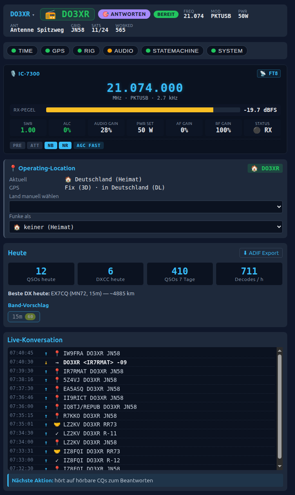
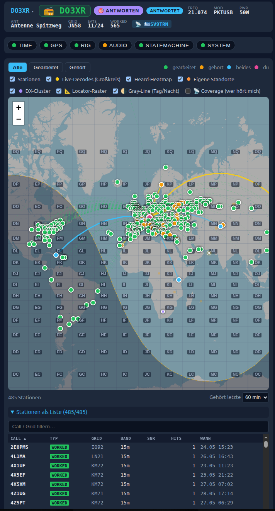

# Architektur — Hochgericht FT8 Appliance

[🇬🇧 English](architecture.md) · **🇩🇪 Deutsch**

**Version:** 3.0
**Status:** Im Feldbetrieb — zwei Pis (`ft8`, `ft8-2`) produktiv
**Operatoren:** DK9XR + DO3XR (Multi-Operator)
**Rigs:** Icom IC-705 / IC-7300

> Hinweis: Dieses Dokument war ursprünglich ein Planungspapier. Es wird
> laufend an den Ist-Stand angeglichen; die vollständige Release-Historie
> steht in [CHANGELOG.md](./CHANGELOG.md).

---

## 1. Mission

Eine "Fire-and-Forget"-FT8-Appliance auf Raspberry Pi 5, die am IC-705 / IC-7300 angesteckt wird und per WLAN mit einem Android-Phone-Browser bedient wird. Bewusst **kein** WSJT-X/WSJT-Z. Nur die wirklich gebrauchten Funktionen, dafür stabil, narrensicher, mit echten Komfort-Features für portablen Urlaubsbetrieb.

Designprinzipien:
- **Minimalismus:** kein GUI-Workaround via Xvfb, kein Subprocess-Zoo.
- **Multi-Operator:** mehrere Profile/Rufzeichen (z.B. Vater + Sohn), Hot-Switch zur Laufzeit, je eigene Logs/Credentials/Lizenzklasse.
- **Field-tauglich:** läuft komplett ohne Internet (mit eingeschränkten Features).
- **Recovery first:** Jede Anomalie wird sofort gemeldet, nicht still geschluckt — und ein abgeschlossenes QSO geht nie verloren (Spill + Backup).
- **Zugang geschützt:** die gesamte API ist passwort-/token-gesichert (localhost vertraut).

---

## 2. Hardware-Stack

| Komponente | Modell |
|---|---|
| Computer | Raspberry Pi 5 (16 GB RAM) |
| Gehäuse | Argon ONE V3 M.2 NVMe |
| Massenspeicher | 1 TB Samsung 990 EVO Plus NVMe |
| Zeit-/Standort-Quelle | u-blox VK-162 USB-GPS |
| Funkgerät | Icom IC-705 (USB: CAT + Audio) |
| Strom | USB-PD Powerbank (5 V / 5 A) |
| Netzwerk | onboard WLAN (BCM43455), kein zweiter Chip |

**HF-Hygiene-Pflicht:** Der IC-705 wird **zwingend in einen USB-2.0-Port (schwarz)** des Pi 5 gesteckt. USB-3.0-Signaling (5 Gbps) emittiert Breitband-RF-Müll ab ~500 MHz aufwärts (siehe Intel-Whitepaper "USB 3.0 Radio Frequency Interference Impact on 2.4 GHz Wireless Devices"). Bei direkter Kabelnähe zum HF-Frontend des IC-705 hebt das den Rausch-Pegel auf 2 m / 70 cm merklich an und kann auch auf HF-Bändern stören. USB 2.0 (480 Mbps) hat mehr als ausreichende Bandbreite für Audio (~768 kbps) + CAT (~38 kbps).

---

## 3. Konnektivität

### 3.1 WLAN-Roaming

NetworkManager mit priorisierter Profilliste:

```
1. Daheim-WLAN
2. Sebastians Android-Hotspot
3. Dads Android-Hotspot
4..N. Manuell via Web nachgepflegte Netze (Camping, Hotel etc.)

→ keiner verfügbar nach 60s → AP-Fallback
```

### 3.2 AP-Fallback

- SSID: `ft8-hochgericht`
- WPA2-PSK, Passwort in `config.yaml`
- Eigenes Captive Portal: `hostapd` + `dnsmasq` + nftables-DNAT auf den lokalen Webserver
- Android öffnet die UI automatisch beim WLAN-Beitritt

**Android Connectivity-Check Handling (Pflicht):**
Modernes Android (und iOS) testet nach WLAN-Beitritt automatisch ob Internet vorhanden ist. Antwortet der DNS/HTTP-Stack falsch, zeigt das Phone "Verbunden, kein Internet" und **kann sich vom WLAN abkoppeln** sobald LTE/Mobilfunk wieder verfügbar wird. Im AP-Fallback wird das verhindert durch:

| Probe-URL | Antwort vom Pi |
|---|---|
| `connectivitycheck.gstatic.com/generate_204` | HTTP 204 No Content |
| `www.google.com/generate_204` | HTTP 204 No Content |
| `clients3.google.com/generate_204` | HTTP 204 No Content |
| `connectivity-check.ubuntu.com` | HTTP 204 No Content |
| alle anderen HTTP-Anfragen | 302 Redirect → `http://ft8.local/` |

`dnsmasq` löst dafür *alle* DNS-Anfragen auf die Pi-IP auf, der lokale Webserver hat dedizierte 204-Handler für die Probe-Pfade.

### 3.3 Fremde Captive Portals

Werden **nicht** vom Pi durchgereicht. Lösungsweg: Dads Android verbindet sich mit dem Fremd-WLAN (Hotel etc.), authentifiziert dort selbst am Portal, teilt das Ergebnis dann per Hotspot weiter an den Pi. Damit fällt das Problem in den Normalfall "Pi connectet zu Android-Hotspot".

### 3.4 mDNS

`avahi-daemon` exposed den Pi als `ft8.local`.

### 3.5 Zeit-Quelle (essentiell)

```
GPS-Satelliten → VK-162 → gpsd → chrony → Systemzeit
                                ↑
                                └─ NTP nur als Backup wenn Internet da
```

GPS-Zeit ist mit ±100 ns extrem genau. FT8 verlangt < 500 ms. Zeit ist damit **unabhängig vom Internet** garantiert, solange GPS Sky-View hat.

---

## 4. Software-Stack

### 4.1 Schichtenübersicht

```
┌─────────────────────────────────────────────────────────────┐
│  Browser (Android Chrome, als PWA installiert)              │
│  Svelte 5 SPA: Decodes, Map, ADIF-Log, Config, Status       │
└──────────────┬──────────────────────────────────────────────┘
               │  HTTP/JSON + Server-Sent Events
┌──────────────▼──────────────────────────────────────────────┐
│  Controller (Python 3.12, FastAPI, uvicorn)                 │
│                                                             │
│   ┌──────────────┐  ┌─────────────┐  ┌──────────────────┐   │
│   │ State Machine│  │ Audio Loop  │  │ Web/SSE Handler  │   │
│   └──────────────┘  └─────────────┘  └──────────────────┘   │
│   ┌──────────────┐  ┌─────────────┐  ┌──────────────────┐   │
│   │ Config       │  │ Integrations│  │ Watchdog/Health  │   │
│   └──────────────┘  └─────────────┘  └──────────────────┘   │
└─┬────────┬───────────────┬───────────────┬──────────────────┘
  │        │               │               │
  │ TCP    │ TCP           │ FFI (cffi)    │ ALSA
  │ 4532   │ 2947          │               │
  ▼        ▼               ▼               ▼
rigctld   gpsd          ft8_lib       IC-705 USB-Audio
(Hamlib)  (GPS)         (Decode/Enc)
```

### 4.2 Decoder/Encoder: `ft8_lib`

- Karlis Goba (YL3JG), MIT-Lizenz, ~2000 LoC C
- Decoder: LDPC + CRC FT8-Standard, voll
- Encoder: vollständiger FT8-Protokoll-Stack
- Integration: `cffi`-Wrapper, im Python-Prozess geladen, kein Subprocess
- Wenn später schwache-Signal-Performance unzureichend: `jt9` aus dem WSJT-X-Quellbaum nachrüstbar als Subprocess (Architektur unverändert)

### 4.3 Backend: Python 3.12 + FastAPI

- **HTTP + SSE:** FastAPI auf uvicorn (uvloop)
- **Audio:** `python-alsaaudio` für Capture (12000 Hz mono) und Playback
- **Rig-Steuerung:** TCP-Client zu `rigctld` (Port 4532). Hamlib >= 4.6 für IC-705
- **GPS:** TCP-Client zu `gpsd` (Port 2947)
- **Persistenz:** `aiosqlite` + leichter Repository-Pattern
- **Slot-Timing:** asyncio-Task synchron zur Systemzeit (xx:00, xx:15, xx:30, xx:45)

### 4.4 Frontend: Svelte 5

- Build mit Vite → statische Files → von FastAPI gemountet
- SSE (kein WebSocket) für Push: Decodes, Status, Heard-Updates
- **Map:** Leaflet, Offline-Tiles vom NVMe vorinstalliert (Welt @ Zoom 1-5, Europa @ Zoom 6-10, ca. 5 GB)
- **PWA-Manifest:** "zum Startbildschirm hinzufügen"
- **Sprachen:** Deutsch (Dad), Englisch — Toggle in der UI
- **Theme:** Auto Day/Night basierend auf GPS-Uhrzeit + Sonnenstand

**Tile-Serving-Trennung (Pflicht):** Die Offline-Tiles liegen physisch in `/var/lib/ft8-appliance/tiles/` (neben der `qso.sqlite`) und werden von FastAPI als eigener `StaticFiles`-Mount unter `/tiles/{z}/{x}/{y}.png` ausgeliefert — **nicht** als Teil des Vite-Build-Bundles. Leaflet referenziert sie per URL-Template. Damit bleibt `backend/ft8_appliance/web/static/` (der Vite-Build-Output) klein (<10 MB), und Tiles lassen sich unabhängig vom App-Update aktualisieren oder regenerieren. Wichtig: tiles liegen explizit **außerhalb** des git-Workdirs (`/home/sebastian/ft8-appliance/`), damit `ft8-self-update.service` (= `git checkout vX.Y.Z`) sie nie anfasst.

### 4.5 Process-Management

systemd-Units:

| Unit | Aufgabe |
|---|---|
| `ft8-controller.service` | Python App |
| `rigctld.service` | Hamlib Daemon |
| `gpsd.service` | GPS Daemon |
| `chrony.service` | Zeit |
| `hostapd@ap0.service` | AP-Fallback (auf Trigger) |
| `NetworkManager.service` | WLAN-Roaming |
| `avahi-daemon.service` | mDNS |
| `ft8-self-update.timer/.service` | zieht alle 10 min getaggte Releases von GitHub, Health-Check + Auto-Rollback |

### 4.6 Zugang & Sicherheit (API-Auth)

Die Appliance steuert einen echten Sender und hält Credentials — die HTTP-API darf daher nicht offen sein. Durchgesetzt via ASGI-Middleware (`web/auth.py`):

- **localhost (127.0.0.1/::1) wird vertraut** — wer auf dem Pi ist, hat via SSH ohnehin Vollzugriff; der Self-Update-Health-Probe läuft über localhost.
- **Statische SPA / Assets / Tiles / Captive-Probes** sind offen (Login muss laden, AP-Captive-Portal muss funktionieren).
- **Alles unter `/api` und `/sse`** braucht den **Master-Token** (`api_token`) via `Authorization: Bearer` ODER `?token=` (Query-Form für SSE, da `EventSource` keine Header setzen kann). Der Master-Token ist als **merkbares Login-Passwort** setzbar (`POST /api/auth/token`).
- **Separater, eng begrenzter `ntfy_action_token`**: nur für operative Control-Toggles (stop/cq/hunt/reset-lock/set-mode/tx-power/set-freq/panic), eingebettet in die ntfy-Lockscreen-Buttons. Ein Topic-Leak erlaubt damit keinen Secret-/Shutdown-Zugriff.
- **Secret-Redaction:** `GET /api/config` liefert keine Klartext-Secrets; `config.yaml` ist `0600`.
- **Kein Netzwerk-Binding-Restriktion** (bindet `0.0.0.0`), weil der AP-Fallback Erreichbarkeit auf allen Interfaces braucht — der Token schützt überall gleich.

---

## 5. State Machine (QSO-Flow)

```
                          ┌──────┐
                  ┌──────►│ IDLE │◄───────────┐
                  │       └───┬──┘            │
                  │           │               │
            [BTN: Stop]   [BTN: CQ]       [QSO complete]
                  │           │               │
                  │           ▼               │
                  │    ┌─────────────┐        │
                  │    │ CQ_CALLING  │        │
                  │    │ alle 30s TX │        │
                  │    └─────┬───────┘        │
                  │          │                │
                  │ [someone answers me]      │
                  │          │                │
                  │          ▼                │
                  │   ┌──────────────┐        │
                  ├───┤ QSO_RESPOND  │        │
                  │   │ TX: "<them>  │        │
                  │   │  <me> <grid>"│        │
                  │   └──────┬───────┘        │
                  │          │                │
                  │   [got signal report]     │
                  │          │                │
                  │          ▼                │
                  │   ┌──────────────┐        │
                  ├───┤ QSO_REPORT   │        │
                  │   │ TX: "<them>  │        │
                  │   │  <me> R-NN"  │        │
                  │   └──────┬───────┘        │
                  │          │                │
                  │       [got RR73]          │
                  │          │                │
                  │          ▼                │
                  │   ┌──────────────┐        │
                  │   │ QSO_LOG      │        │
                  │   │ ADIF + DB    │        │
                  │   │ PSK Reporter │        │
                  │   └──────┬───────┘        │
                  │          │                │
                  │          ▼                │
                  │   ┌──────────────┐        │
                  └───┤ QSO_GRACE    │────────┘
                      │ 1 Slot warten│
                      │ ggf. Tx6=73  │
                      └──────────────┘
```

**QSO_GRACE-Mechanik (Sebastian 2026-05-24, Audit-Finding 2):** Nach
RR73 + LOG_QSO sitzen wir 1 Slot lang in QSO_GRACE und lauschen ob der
Partner sein RR73 wiederholt (= unser RR73 nicht decodiert). Wenn ja:
ein 73 (Tx6) hinterher als Closure-Bestätigung — analog WSJT-X. Sonst
nach 1 Slot weiter zu CQ_CALLING (auto_cq=True) oder IDLE.

**Vor jedem TX-Transition prüft die State Machine:**
- Time-Guard: GPS-Sync OK, DT < 0.5 s
- PTT-Watchdog: max. 18 s pro Aussendung
- ALC: Pegel im grünen Bereich
- SWR: < konfigurierter Schwellwert (default 2.0)
- Battery: IC-705 internal voltage > 12 V (falls auf Akku-Betrieb)
- Band-Lockout: aktive Antenne deckt das Band ab
- IARU-Bandplan-Lockout: TX-Frequenz im erlaubten FT8-Segment der GPS-bestimmten Region

Bei Verletzung einer Bedingung: TX wird verweigert, UI zeigt Alarm-Badge.

Zusätzliche Modi:
- **Hunting:** statt CQ wird auf fremde CQs reagiert (Button-Auswahl welche)
- **Run vs. S&P:** "Run" stay-on-frequency, "S&P" answer + move on
- **Panic-Stop:** sofortiges PTT-Off + State → IDLE, TX-Lock bis Button-Reset

---

## 6. Feature-Set

> UI-Eindruck (Demo-Modus, fiktive Daten): Decode-Liste, Tagesstatistik,
> Weltkarte mit Coverage und das gefilterte Logbuch.
>
> 
> 

### 6.1 Core (MVP)

- FT8-Decode über volle 3 kHz Passband
- **FT4-Decode + -Encode** parallel (7.5 s Slot, 4-FSK, 105 Symbole) —
  Mode-Switch in `OperatingConfig.mode`, separate Shim-Funktionen
  `ft4_shim_decode_slot` / `ft4_shim_synth_message`, `SlotClock(slot_seconds=…)`.
  FT8↔FT4 wechselt **live beim Hot-Reload** (kein Neustart): `SlotClock.set_slot_seconds`
  retunt die laufende Uhr, die `_iter`-Schleife liest die Kadenz pro Zyklus neu
  (gefixt 2026-06-11 — vorher behielt der laufende Iterator den alten Takt).
- FT8-Encode + TX via CAT-PTT
- Auto-CQ
- Auto-Reply auf Anrufer (komplette QSO-Sequenz)
- Hunting-Mode (auf fremde CQs antworten)
- Slot-synchrones TX/RX-Timing aus GPS-Zeit
- Watchdog-Familie:
  - PTT-Max-Zeit (Hard-Limit pro Aussendung)
  - **CQ-Idle-Watchdog** (`cq_idle_timeout_min`, Default 10 min): wenn
    seit X Minuten CQ ohne Pickup → ntfy-Push mit Action-Buttons
    („STOP CQ" / „Auf Hunting"). Pi schaltet **nie** selbst ab —
    Sebastians ausdrückliche Regel 2026-05-24
  - **Mode-Watchdog** (`mode_watchdog_min`, Default 15 min): keine
    Decodes mehr → Funkstille-Push (Antenne/Audio prüfen)
  - **Boot-Mode-Mismatch-Watchdog**: `boot_mode != "off"` aber kein
    Auto-Modus aktiv → Push „Pi steht still"
  - **Tamper-Detection** (Sebastian 2026-05-24): externe Änderungen am
    Rig (Power, Mode, Filter, Frequenz) lösen ntfy-Push mit Rollback-
    Action aus; Eigene CAT-Befehle werden via Echo-Window-Helper
    erkannt und nicht alarmiert (siehe §6.5)
- ADIF-Log (live in der UI, exportierbar)
- Band-Presets (Standard-FT8-Frequenzen)
- Rufzeichen, Locator (oder GPS-Auto), Power-Profile
- Decode-Liste live
- Audio-Gain Kalibrierung + Live-Monitoring + Alarm bei Drift
- TX-Power per CAT setzbar (Default: max, manuell wählbar)

### 6.2 Smart Operating

- **20-Tier Hunting-Picker** (konfigurierbare Prioritäts-Reihenfolge,
  `OperatingConfig.hunt_priority`, Drag-and-Drop im UI): lexikografisches
  Scoring über Tiers wie `not_bad_reputation`, `not_in_pileup`,
  `tail_end_target`, `grayline`, `band_open`, `buddy_seen`, `new_dxcc(_band)`,
  `psk_heard_us`, `psk_snr`, `new_grid(_band)`, `not_worked`,
  `dxcc_rarity`, `snr`.
  Details: [`docs/hunt_priority.md`](docs/hunt_priority.md).
- **Konservative Hunt-Gates:** vor dem Tier-Scoring werden schwache einzelne
  Routine-CQs uebersprungen, wenn sie keinen Award-/Kontextwert und kein gutes
  Decode-/PSK-SNR haben. Nach einer schlechten Hunt-Serie geht der Picker
  temporaer in Strict Mode und verlangt dieselbe Evidenz fuer Routine-Ziele.
  `hunt_profile` kann Routine-Picks Richtung Rate oder DX gewichten; Balanced
  FT4 nutzt das Rate-Gate, FT8 bleibt breiter.
- **Hard-Filter** zusätzlich zur Soft-Reihenfolge: `skip_worked` (nur nie
  Gearbeitete), `dxcc_only` (Award-Modus: lieber Funkstille als Nicht-ATNO).
- **Soft-Blacklist / Reputation** (DB-gestützt, GLOBAL über Operatoren,
  Basis-Call-normalisiert): Stationen die wiederholt abbrechen/verstummen
  werden abgewertet.
- **Band-bewusster QSO-Cooldown:** Erfolgs-Cooldown pro (Call, Band) — ein
  langer Cooldown blockt damit keinen neuen Band-Slot (5BWAS/VUCC).
- **Pick-Telemetrie (`pick_attempt`):** loggt jeden Hunt-Pick mit Ausgang
  (completed / went-silent / bailed) plus reichem Kontext — entscheidende Stufe
  (`winning_tier`), wie laut *wir* bei der DX-Station ankommen (`psk_snr`, aus
  PSK-Reporter), Pick-Alter, # Kandidaten, Resends, Distanz, Kontinent, Mode,
  TX-Leistung, Band-Belegung, SNR/DT — für datengetriebenes A/B der Tiers
  (`/api/stats/pick-attempts`). Trieb das **2026-06-Retune**: `tail_end_target`
  unter `snr` (nur ~3 % Completion als Entscheider); `psk_heard_us` erst
  hochgestuft, dann zurückgestuft, als ein größeres Sample zeigte, dass das
  *binäre* „hört uns"-Flag ein schwaches Picker-Signal ist (~2,6 % als
  Entscheider vs ~8 % Baseline) — der echte Prädiktor ist die *graduelle*
  `psk_snr` (laut bei der DX ≈ 14 % vs ~7,6 % grenzwertig), jetzt echter
  Picker-Tier und weiterhin Telemetrie. ~72 % der Picks sind „sole" (keine
  Wahl) → Tier-Reihenfolge ist inhärent Low-Leverage; der dominante Fehlschlag
  ist der unbeantwortete erste Anruf, der mit `psk_snr`/Distanz (gehört werden)
  korreliert, nicht mit der Auswahl.
- TX-Frequenz-Wahl mit Kollisions-Vermeidung: Rotation 1200/1500/1800/2100 Hz
  pro CQ-Sendung (`MachineContext.cq_freq_rotation`)
- Smart-CQ-Throttling (passive Sondierung nach N erfolglosen CQs) — geparkt
- Run vs. S&P Mode-Switch
- "Only answer calls to me" Filter
- Worked-B4-Anzeige
- **Tail-Ender**: direkter Report-Empfang ohne Grid-Stage springt
  CQ_CALLING → QSO_REPORT (zwei Slots gespart)
- **Auto-CQ-Loop** (WSJT-Z-style): nach LOG_QSO zurück nach CQ_CALLING bis
  User Stop drückt — gesteuert über `MachineContext.auto_cq`
- **ALC Closed-Loop**: `_observe_alc_during_tx` trimmt Audio-Gain
  (0.05..1.0) in den Target-Window-Range; Operating-Config:
  `audio_gain` / `alc_target_low` / `alc_target_high`
- **Multi-Color-Highlighting**: Decodes annotiert mit `is_new_dxcc`,
  `is_new_grid`, `is_new_grid_on_band` (Sets `_worked_grids` +
  `_worked_grid_band` hydriert aus DB, gepflegt in `_do_log_qso`)
- **WSJT-X-konforme QSO-Resilience** (Sebastian 2026-05-24 nach
  UN7JO-/Audit-Session):
  - **R-Report-Resend** in QSO_REPORT: wenn Partner statt RR73 nochmal
    seinen Report schickt (= unsere R-Report nicht decodiert), senden
    wir R-Report 1× erneut bevor wir aufgeben. Config:
    `qso_max_report_resends` (Default 1, Range 0..3)
  - **Tx6/73-Closure-Ack** über QSO_GRACE-State: 1-Slot-Fenster nach
    RR73 + LOG_QSO; wenn Partner sein RR73 wiederholt → 73 hinterher
    als finale Bestätigung
  - **Grid-Resend** in QSO_RESPOND: wenn Partner uns ignoriert und
    weiter CQ ruft, senden wir Grid bis zu `qso_max_cq_resends`
    Mal nach, dann bail + Failed-Cooldown
  - Laufendes WSJT-X-Korrektheits-Audit der State-Machine:
    siehe [`docs/wsjtx_qso_state_audit.md`](./docs/wsjtx_qso_state_audit.md)
    + Memory `feedback_wsjtx_korrektheit.md`. **Achtung:** dies ist
    **kein** Feature-Parity-Sweep (der ist via
    `project_ft8_wsjtx_tier.md` separat gescoped und gecappt)

### 6.3 Antennen-Schutz

- Aktive Antennen-Profile (z.B. "Endfed 20m", "Doublet 80/40/20")
- TX-Lockout für Bänder ohne passende Antenne
- SWR-Curve Logger pro Band

### 6.4 Portable-Operation & CEPT

- Auto-QTH/Locator via GPS (Maidenhead 6-stellig)
- **GPS-Länder-Erkennung via Point-in-Polygon** (`integrations/cept.py` +
  `data/cept_borders.json`, vereinfachte Natural-Earth-Grenzen): bbox als
  Vorfilter, dann echte Polygone zur Disambiguierung (löst Balkan-/Adria-
  Overlaps wie Kroatiens C-Form um Bosnien sauber, ohne Reihenfolge-Hacks).
- **CEPT-Compliance:** kennt für deutsche **Klasse A (T/R 61-01)** und
  **Klasse E (ECC/REC (05)06)**, wo man **ohne Gastlizenz** im Kurzzeit-
  betrieb funken darf — Primärquelle ist die DARC-Länderliste. Ausgesetzte
  Länder (Belarus, Russland) werden gesperrt. Vorschlag des korrekten
  CEPT-Präfix (`<area>/DK9XR`); kein Auto-Switch, Operator bestätigt.
- IARU-Bandplan-Lockout pro Region (R1/R2/R3)

### 6.5 Monitoring & Safety

- SWR-Alarm + TX-Stop bei Überschreitung
- IC-705 Batterie-Monitor (Vbus via CAT)
- Pi-CPU-Temperatur (Alarm > 75 °C)
- Storage-Watcher (SSD-Wear, Plattenplatz)
- Multi-Level Watchdog: in-process Heartbeat + systemd Watchdog + optional GPIO HW-Watchdog
- PTT-Stuck-Detection (PTT-an aber kein Audio → sofort off)
- Time-Guard (kein TX ohne GPS-Sync)
- **Blitzortung.org** Live-Daten, Alarm bei Gewitter innerhalb eines
  konfigurierbaren Radius (Default 30 km, `alarm_radius_km`; seit 2026-06 hot-reloadbar)

**Daten-Sicherheit (Audit 2026-05-30):** Die unersetzlichen Logdaten sind mehrfach abgesichert:
- **Atomare Config-Writes** (`util/atomicfile.py`): tmp + `fsync(file)` + `fsync(dir)` + rename, `.bak`-Snapshot, `0600`, prozessweiter Write-Lock gegen konkurrierende Schreiber. `PUT /api/config` plättet keine Operatoren/Secrets mehr (`preserve_secrets`: „leer = behalten").
- **SQLite robust:** WAL + `synchronous=NORMAL` + `busy_timeout=30s` (eliminiert „database is locked" zwischen QSO-Insert und Upload-Drains).
- **QSO-Spill:** schlägt der DB-Write eines abgeschlossenen QSO fehl (volle SD/Lock/Korruption) → Sicherung in `unlogged_qsos.jsonl` + ntfy-Alarm, automatischer Nachtrag beim nächsten Erfolg/Start. **Kein stiller QSO-Verlust.**
- **Tägliches DB-Backup** (`VACUUM INTO`, Rotation 7) + **Telemetrie-Retention** (decode/pick_attempt/heard/swr/psk auf 90 Tage; `qso` nie).

**Tamper-Detection (Sebastian 2026-05-24):** Wenn jemand am Rig-
Frontpanel Settings dreht (häufiges Szenario: „Dad pfuscht heimlich")
soll der Pi pingen statt blind nachzuziehen. Mechanik:

1. **Echo-Window**: jede App-initiierte CAT-Änderung wird in
   `_recent_app_commands[key] = (sollwert, monotonic_ts)` registriert
   (Helper `Orchestrator._register_app_command`, TTL 3 s).
2. **Rig-Poll-Sync** (alle 1 s): wenn rig-Wert ≠ unser interner Stand
   → Echo-Check via `_is_app_echo(key, rig_value, tolerance=...)`:
   - Match innerhalb Window → eigener Befehl, silent sync
   - Mismatch ODER Window abgelaufen → **externe Änderung** →
     `asyncio.create_task(self._notify_xxx_tamper(...))`
3. **Throttle pro Setting**: nur 1 Push pro neuem Wert. Dreht jemand
   von 50W → 30W → 5W, kommen 2 Pushes (für 30 und 5), bleibt's bei
   30W kein weiterer.
4. **Boot-Gate**: `_tamper_armed`-Flag erst nach dem ersten kompletten
   Sync gesetzt — beim Service-Restart wissen wir nicht was vorher
   gedreht wurde, daher silent initial-sync.

Überwachte Settings: TX-Power (`rfpower_norm`), Mode (`mode`),
Filterbreite (`bandwidth_hz`, nur < 2000 Hz oder > 6000 Hz alarmiert
weil IC-7300 FIL1/2/3-Slots regulär 2700/3600 sind), Frequenz (eigener
Pfad via Frequenz-Drift-Watchdog mit 100-Hz-Toleranz, Rollback-Action
„Auf XXm zurück").

### 6.6 Integrations (online)

- **QRZ.com XML API** (Callsign-Lookup) + **QRZ Logbook API** (Auto-Upload der QSOs, pro On-Air-Call eigenes Logbuch/Key via `qrz_logbooks`)
- **Club Log** Auto-Upload (realtime + putlogs-Bulk), per-Operator-Account
- **HamQTH** als kostenloser Lookup-Fallback
- **cty.dat** lokal als Offline-Fallback (DXCC-Präfix → Land/Kontinent)
- **PSK Reporter:** Upload eigener Decodes + Download "wer hat mich gehört?" (speist den `psk_heard_us`-Reziprozitäts-Tier)
- **hamqsl.com:** Solar-Indizes (SFI, A/K, MUF), kleines Widget
- **NG3K ADXO:** Auto-Import des DXpeditions-Kalenders → Watchlist + 24h-ntfy-Reminder
- **DX-Cluster** (Telnet) als zusätzliche Spot-Quelle
- **Marinefunker (DF7PM-Liste):** ⚓-Badge + MF-Nr bei aktiven Mitgliedern, eigener Picker-Tier
- **Upload-Resilience (v0.40.0, gehärtet 2026-06):** QRZ/ClubLog markieren ein QSO nur bei *klar hartem* Reject als erledigt; transiente Fehler werden erneut versucht (Ceiling 15 + Aufgeben-Alarm). Ein 2026-06-Vorfall deckte eine Lücke auf: ein tz-naive-vs-aware-`datetime`-Crash in **beiden** Drain-Loops staute Uploads ~2 Wochen, während er als harmloser Zyklus-„Hiccup" verschluckt wurde. Fix = zwei Sicherungsnetze: (a) `_as_utc()`-Coercion von DB-Datetimes + ein `DTZ`-Lint-Gate gegen naive Datetimes, und (b) **Drain-Loop-Failure-Eskalation** (`_note_drain_outcome`) — N aufeinanderfolgende Fehl-Sweeps lösen jetzt einen ntfy-Alarm (`push.upload_stuck_*`) aus statt still zu bleiben.

**Resilience-Prinzip (gilt für alle Online-Features):**
Jede Online-Integration muss **graceful degraden**:
- Aggressive Timeouts (max 5 s pro Request, kein Blocking)
- Lokaler Cache mit TTL; UI zeigt Cache-Alter ("Daten von vor 12 min")
- Bei Ausfall: Badge `offline` an der jeweiligen UI-Komponente, kein Error-Popup, keine Fehlerkaskade
- Core-Funktionalität (Decode, TX, QSO-Sequence, Log) ist **niemals** von Online-Diensten abhängig
- Failure einer Integration darf keine andere beeinflussen (Kreis-Breaker pro Service)

### 6.7 UI / Maps

- Live-Map: gearbeitete Stationen (eine Farbe) + aktuell gehörte (andere Farbe)
- Heard-Heatmap History (letzte 24 h)
- Offline-Tiles
- ADIF-Tabelle suchbar/filterbar
- Status-Badges: GPS-Fix, Zeit-Sync, Rig-Verbindung, WLAN-Status, SWR, ALC, Akku, Temperatur
- Panic-Stop Button (groß, rot, immer sichtbar)
- QSO-Skip Button (während laufender Sequenz)
- Callsign-Blacklist
- Best-Time-Predictor Widget (basierend auf PSK Reporter History)

### 6.8 Push & Remote (out)

- **ntfy.sh** Push-Notifications: neue DXCC, neue Region, QSO-complete, kritische Alarme
- Sound-Alerts in der Web-UI (Browser-Notification API)

### 6.9 Konfig-Quality

- Alle Settings via Web (kein SSH-Gefummel im Feld)
- Hot-Reload bei Config-Änderungen
- Config-Versionierung mit Rollback-Möglichkeit
- First-Boot Setup-Wizard

### 6.10 Internationalisierung (i18n) — komplett zweisprachig DE/EN

Oberfläche **und** Backend-erzeugte Strings sind zweisprachig mit Live-Umschalter
im Header (Default Deutsch, die Operatoren sind deutsche Funkamateure):

- **Frontend-Katalog:** `frontend/src/lib/i18n.svelte.js` (`lang`-Store + `t()`),
  Strings in `lib/locales/{de,en}.js`. Reaktiv — Umschalten rendert alles neu.
- **Backend-Katalog:** `backend/ft8_appliance/i18n.py` (`_DE`/`_EN` + `translate(key, lang, **params)`)
  für Backend-Texte: Guard/Lock-Gründe (`guard.*`/`lock.*`), Status-Hints
  (`hint.*`), ntfy-Push-Bodies (`push.*`). Keine Überschneidung mit Frontend-Keys.
- **Browser-Strings** (Status/SSE/Control): die State-Machine speichert Code +
  Params; Übersetzung beim Ausliefern via `?lang=` (`web/deps.ui_lang`), das das
  Frontend an JEDEN Request + beide SSE-URLs hängt.
- **ntfy-Push-Bodies** (kein Request — gehen aufs Handy): zur Generierungszeit
  über den Config-Default (`config.ui.language` → `i18n.set_default_lang()` beim
  Start).
- **Drei CI-Gates** (laufen in `release.sh`): DE/EN-Key- + Platzhalter-Parität
  (Front + Back), AST-Call-Site-Param-Deckung und ein Hartcodiert-Deutsch-Scanner
  über die `.svelte`-Templates. `translate()`/`t()` crashen NIE bei fehlendem
  Key/Param — sie leaken rohe `{Klammern}` — daher die Gates.

---

## 7. Daten-Modell

### 7.1 `config.yaml`

**Multi-Operator-Modell** (Sebastian 2026-05-23): mehrere Operator-Profile
mit eigenen Logs, QRZ-Accounts und Lizenzklassen sind moeglich.
Backward-Compat: alte single-`operator:`-Configs werden beim Load
automatisch in `operators: [...]` + `active_callsign` umgewandelt.

```yaml
# Neue Form (mehrere Operatoren)
operators:
  - callsign: DK9XR
    default_locator: JN58td      # leer = GPS auto
    default_power_w: 50
    license_class: A             # A | E | N (deutsche AfuV)
    qrz_user: DK9XR
    qrz_password: secret
    qrz_logbook_api_key: ABCD-1234
    clublog_email: dk9xr@example.org
    clublog_app_password: "..."
    clublog_api_key: "..."
    qrz_logbooks:                # On-Air-Call → eigener QRZ-Logbook-Key
      DK9XR/AM: WXYZ-9876        # QRZ braucht pro Prefix/Suffix ein Logbuch
    home_country: DL
    current_operating_country: null   # gesetzt bei CEPT-Auslandsbetrieb
  - callsign: DL2XYZ
    default_locator: JO31
    default_power_w: 100
    license_class: E

active_callsign: DK9XR           # aktueller Operator (Hot-Switch via API)
operator_auto_login_seconds: 30  # nach Service-Start Auto-Default
api_token: "..."                 # API-Login (als Passwort setzbar); 0600, aus GET redacted
ntfy_action_token: "..."         # enger Token nur für ntfy-Control-Buttons
```

> `operating:` hat über die unten gezeigten hinaus weitere Felder, u.a.
> `mode` (FT8/FT4), `hunt_priority` (20-Tier-Reihenfolge), `hunt_profile`,
> `hunt_skip_worked`, `hunt_dxcc_only`, `qso_cooldown_min`,
> `psk_reciprocity_enabled`, `tail_end_hunter_enabled`, `boot_mode`,
> `mode_watchdog_min`.

Alte Form (immer noch akzeptiert, transparente Migration):
```yaml
operator:
  callsign: DK9XR
  default_locator: JN58td
  default_power_w: 10
```

bands:
  - name: "20m"
    freq_khz: 14074
    antenna: endfed_2040
  - name: "40m"
    freq_khz: 7074
    antenna: endfed_2040

antennas:
  - name: endfed_2040
    bands: ["20m", "40m"]
  - name: doublet_80_40_20
    bands: ["80m", "40m", "20m"]

operating:
  auto_cq_interval_s: 30
  max_ptt_s: 18
  cq_idle_timeout_min: 10
  swr_max: 2.0
  alc_max: 0                     # 0 = nie kompressionsfähig

network:
  wifi_priority:
    - { ssid: "Heimnetz", psk: "..." }
    - { ssid: "Seb-iPhone", psk: "..." }
    - { ssid: "Dad-Android", psk: "..." }
  ap_fallback:
    ssid: "ft8-hochgericht"
    psk: "..."

integrations:
  qrz:
    enabled: true
    user: "dk9xr"
    password: "..."
  hamqth:
    enabled: true
  psk_reporter:
    enabled: true
    upload_decodes: true

ui:
  language: de
  theme: auto
```

### 7.2 SQLite Schema (Skizze)

> Skizze — der reale Stand wird über additive Migrationen in
> `db/session.py` gepflegt (nur `ALTER TABLE ADD COLUMN`, idempotent).
> Zusätzlich zu den unten gezeigten existieren u.a.: **`pick_attempt`**
> (Picker-A/B-Telemetrie), **`call_reputation`** (Soft-Blacklist, global),
> **`watchlist`**, **`dxpedition_schedule`**, **`freq_reputation`** (Smart-CQ).
> WAL ist aktiv. Mehrere Tabellen tragen `user_callsign` (Multi-Operator).

```sql
CREATE TABLE qso (
  id          INTEGER PRIMARY KEY,
  call        TEXT NOT NULL,
  band        TEXT NOT NULL,
  freq_hz     INTEGER NOT NULL,
  mode        TEXT NOT NULL DEFAULT 'FT8',
  rst_sent    INTEGER,
  rst_rcvd    INTEGER,
  grid_rcvd   TEXT,
  qso_start   TIMESTAMP NOT NULL,
  qso_end     TIMESTAMP NOT NULL,
  my_grid     TEXT NOT NULL,
  my_power_w  INTEGER,
  swr_avg     REAL,
  notes       TEXT,
  -- Multi-Operator + DX + Upload-Tracking (spätere Migrationen):
  user_callsign    TEXT,   -- welcher Operator (Heimat-Call)
  station_callsign TEXT,   -- tatsächlich gesendeter Call (z.B. 9A/DK9XR)
  mf_mfnr          INTEGER,-- Marinefunker-Nr (Snapshot)
  qrz_uploaded     BOOLEAN DEFAULT 0,
  qrz_upload_attempts INTEGER DEFAULT 0,
  qrz_last_attempt_at TIMESTAMP,
  clublog_uploaded BOOLEAN DEFAULT 0,
  clublog_upload_attempts INTEGER DEFAULT 0,
  clublog_last_attempt_at TIMESTAMP
);

CREATE TABLE decode (
  id          INTEGER PRIMARY KEY,
  ts          TIMESTAMP NOT NULL,
  call_from   TEXT,
  call_to     TEXT,
  grid        TEXT,
  message     TEXT NOT NULL,
  snr_db      INTEGER,
  dt_s        REAL,
  freq_offset_hz INTEGER,
  band        TEXT
);
CREATE INDEX idx_decode_ts ON decode(ts);

CREATE TABLE heard (
  call        TEXT PRIMARY KEY,
  last_seen   TIMESTAMP NOT NULL,
  count       INTEGER DEFAULT 1,
  grid        TEXT,
  best_snr    INTEGER
);

CREATE TABLE psk_reporter_in (
  ts          TIMESTAMP NOT NULL,
  rx_call     TEXT NOT NULL,
  rx_grid     TEXT,
  snr_db      INTEGER,
  band        TEXT,
  PRIMARY KEY (ts, rx_call)
);

CREATE TABLE swr_log (
  ts          TIMESTAMP NOT NULL,
  band        TEXT NOT NULL,
  freq_hz     INTEGER NOT NULL,
  swr         REAL NOT NULL
);

CREATE TABLE blacklist (
  call        TEXT PRIMARY KEY,
  added       TIMESTAMP NOT NULL,
  reason      TEXT
);

CREATE TABLE config_history (
  id          INTEGER PRIMARY KEY,
  ts          TIMESTAMP NOT NULL,
  yaml_snapshot TEXT NOT NULL
);
```

---

## 8. Datenfluss (Hot Loop)

```
t=0s   ┌─ ALSA-Capture läuft kontinuierlich (Ringbuffer)
       │
       │  Slot-Start (UTC xx:00/15/30/45 ± 0.5s vom Time-Guard verifiziert)
       ▼
t=0s   Slot beginnt, RX-Modus
       Audio-Samples werden gepuffert
       ...
t=13.5s Slot fast voll, Decode-Task startet (parallel zum letzten Audio)
       ft8_lib decoded → Liste von Decodes mit Call/Grid/SNR/DT
       ▼
t=14.0s Decodes ins SQLite, an State Machine, an Frontend-SSE
       State Machine entscheidet: was tun im nächsten Slot?
       ▼
t=14.5s Wenn TX entschieden:
         - Pre-flight checks (alle Guards)
         - rigctld set_freq, set_mode
         - ft8_lib encode message → 12000 Hz PCM
         - rigctld set_ptt 1
       ▼
t=15.0s Neuer Slot, ALSA-Playback der encoded Symbole
       PTT-Watchdog Timer läuft
       ▼
t=27.5s TX fertig, PTT off, RX wieder aktiv
       Audio-Capture läuft eh weiter
       ▼
t=30.0s Nächster Slot beginnt, Schleife schließt
```

### 8.1 Audio-Slot-Synchronisation (Anti-Drift)

**Problem:** Der IC-705 USB-Audio hat einen eigenen Quartz (~±50 ppm). Der Pi-Systemtakt kommt von GPS (±100 ns). Über mehrere Slots driften beide auseinander. Würde man die Slot-Position nur aus Sample-Count rechnen, akkumuliert der Drift bis zu DT-Verletzung.

**Lösung (Phase-Locking, nicht Resampling):**

1. **GPS-Zeit ist Master-Clock.** Slot-Grenzen werden allein aus `chrony`-Systemzeit bestimmt, nie aus ALSA-Sample-Positionen.
2. **Anker bei Slot-Start:** Beim Slot-Beginn (`t = xx:00.000` UTC ± 1 ms aus chrony) wird die aktuelle ALSA-Capture-Position über `snd_pcm_status_get_avail` als Anker-Sample notiert (`anchor_frame`).
3. **Harter Cut nach 15 s:** Aus dem Ringbuffer werden exakt `12000 × 15 = 180000` Samples ab `anchor_frame` herausgeschnitten und an `ft8_lib` übergeben.
4. **Pro Slot rekalibriert:** Beim nächsten Slot wird `anchor_frame` neu gesetzt — Drift akkumuliert nicht über Slot-Grenzen hinweg.
5. **TX-Pfad analog:** ALSA-Playback wird gestartet wenn `chrony.now() == nächste_slot_start`, nicht wenn Encoder fertig ist (Encoder muss vorher fertig sein, sonst Late-TX-Penalty).
6. **Drift-Monitoring:** Differenz `expected_samples_per_slot` vs. `actual_samples_per_slot` wird geloggt. Bei > 5 Samples (0.4 ms) Diff → Warnung in UI; bei > 50 Samples → Audio-Kalibrier-Alarm (ALSA-Karte oder Quartz defekt).
7. **Erst wenn Drift > 0.5 % über mehrere Slots auftritt** (was nicht passieren sollte) wird Resampling als Workaround in Erwägung gezogen — derzeit nicht im Scope.

Diese Strategie entspricht dem Phase-Lock-Prinzip aus WSJT-X' eigenem Audio-Handling und vermeidet aufwändige Echtzeit-Resampling-Logik im Hot Path.

---

## 9. Build & Deploy

### 9.1 Repo-Struktur (geplant)

```
hochgericht-ft8/
├── backend/
│   ├── pyproject.toml
│   ├── ft8_appliance/
│   │   ├── main.py
│   │   ├── audio/
│   │   ├── decode/        ← cffi-wrapper für ft8_lib
│   │   ├── statemachine/
│   │   ├── rig/           ← rigctld-Client
│   │   ├── gps/
│   │   ├── integrations/  ← QRZ, HamQTH, PSK Reporter, hamqsl, Blitzortung
│   │   ├── web/           ← FastAPI Routes + SSE
│   │   ├── db/
│   │   └── config/
│   └── tests/
├── frontend/
│   ├── package.json
│   ├── vite.config.js
│   └── src/
│       ├── routes/
│       ├── lib/
│       └── components/
├── vendor/
│   └── ft8_lib/           ← als git submodule
├── deploy/
│   ├── systemd/
│   ├── networkmanager/
│   ├── chrony/
│   └── install.sh
├── data/
│   └── cty.dat            ← offline DXCC database
├── tiles/                 ← offline map tiles (gitignored, generiert)
├── architecture.md        ← dieses Dokument
└── README.md
```

### 9.2 Bring-up Phasen

> **Stand:** alle Phasen durchlaufen — die Appliance ist auf zwei Pis
> (`ft8`, `ft8-2`) im produktiven Feldbetrieb. Die folgende Liste ist die
> ursprüngliche Bring-up-Reihenfolge (historisch).

1. **Phase 0:** Pi-OS Lite Install, SSH, NVMe-Boot, systemd-Grundlagen
2. **Phase 1:** Hardware-Verify: ALSA findet IC-705, rigctld redet mit Rig, gpsd liefert Fix
3. **Phase 2:** Decoder-Spike — ft8_lib auf gespeicherte WAV-Files anwenden
4. **Phase 3:** Live-Decode-Loop in Python, Decodes auf stdout
5. **Phase 4:** Encoder + TX-Pfad, PTT-Watchdog hart getestet
6. **Phase 5:** State Machine + Logging
7. **Phase 6:** Web-Backend + minimale Svelte-UI (Decode-Liste + Buttons)
8. **Phase 7:** Map + ADIF-Tabelle + Status-Badges
9. **Phase 8:** Online-Integrations (QRZ, PSK Reporter, hamqsl)
10. **Phase 9:** Antennen-Profile, Band-Lockouts, IARU-Logik
11. **Phase 10:** AP-Fallback + Captive Portal + WLAN-Roaming
12. **Phase 11:** Push (ntfy), Sounds, Theming, PWA-Polish
13. **Phase 12:** Feldtest

---

## 10. Decisions Journal

| Entscheidung | Gewählt | Verworfen | Begründung |
|---|---|---|---|
| Decoder | ft8_lib | jt9, WSJT-X/Z headless | MIT, klein, kein Fortran, kein Xvfb, kein Subprocess |
| Backend | Python 3.12 + FastAPI | Go, Rust | Audio/GPS/Ham-Ökosystem, Dev-Speed |
| Frontend | Svelte 5 (statisch) | Vanilla JS, Vue, React, HTMX, SvelteKit | Kleinste Bundles, scaling mit Features, kein Node-Server |
| Push-Protokoll | SSE | WebSocket | Einseitig reicht, robuster, einfacher |
| Persistenz | YAML (Config) + SQLite (Daten) | Pure SQLite, Pure YAML | YAML menschen-editierbar, SQLite für strukturierte Daten |
| Multi-User | Multi-Operator-Profile in YAML | DB-Tabelle | YAML konsistent mit Bands/Antennas, diff-friendly, Hot-Switch via /api/operators/select |
| WLAN-Topologie | Single-Chip + AP-Fallback | Dual-Chip Travel-Router | User-Entscheidung |
| Captive-Portal Fremd-WLAN | nicht durchgereicht | Travel-Router-Modus | Phone-Hotspot löst es transparent |
| Zeit-Quelle | GPS (chrony) | NTP allein | Internet-Unabhängigkeit |
| PTT-Methode | CAT (Hamlib) | RTS/DTR, VOX | Deterministisch, Watchdog-tauglich |
| Audio-Capture | ALSA direkt | PulseAudio, PipeWire | Latenz, weniger Abhängigkeiten |
| USB-Port für IC-705 | USB 2.0 (schwarz) | USB 3.0 (blau) | USB 3.0 emittiert HF-Müll → RX-Noise-Floor |
| Audio-Slot-Sync | Phase-Lock zu GPS-Zeit, harter Cut pro Slot | Sample-Count, Resampling | Drift akkumuliert nicht, kein Echtzeit-DSP nötig |
| Captive-Portal Connectivity-Check | 204-Antworten für Google/Ubuntu-Probes | nichts tun | Android koppelt sonst vom Pi-WLAN ab |
| Online-Integrations-Resilience | Cache + Graceful Degrade + Circuit Breaker | Hard-Dependencies | Field-Tauglichkeit ohne Internet |
| Decoder-Mode-Mix | standard / deep / multi / extreme (Default extreme seit v0.7.1) | nur 1 fixer Mode | Pi 5 hat CPU-Reserve, Subtract+Hint+Notch bringen ~5-6% mehr Decodes; CPU-Adaptive Fallback bei Überlast |
| Decoder-Subtract-Pfad | echter Subtract-and-Rerun (synth → in-place subtract → re-decode) | nur Pass1+Pass2-Merge | JTDX-Style maskierte schwächere Signale werden sichtbar |
| Hint-Pass-Validation | Decoded text muss known-call enthalten | AP-Decoding | False-Positive-Filter äquivalent zu JTDX Type-2; vermeidet AP-Phantome |
| Auto-Notch-Pfad | FFT-Spektral-Notch pro Slot, numpy-only | scipy biquad-cascade | scipy 150MB Dep auf Pi vermieden |
| Pass-Stats-Tracking | Per-Pass-Counts in `/api/status.decoder_pass_stats` | nur Gesamt-Counter | datengetriebene Insight welcher Pass real Mehrwert bringt |
| DT-Offset-Korrektur | Auto-Kalibrierung via rolling-Median | nur Diagnose-Push | Self-correcting bei systematischen Audio-Buffer-Offsets |
| PSK-Reporter | Upload aus Decode-Pfad aktiv (`upload_decode()` aus dem Slot-Handler) | Client implementiert aber unangetastet | Reziproker Community-Wert ohne PII |

> **Detail-Doku zu allen Decoder-Releases v0.5.2 – v0.8.0**:
> siehe [`docs/decoder_evolution.md`](docs/decoder_evolution.md)

---

## 11. Out of Scope (bewusst gestrichen)

- Wasserfall-Anzeige
- JT9/JT65/MSK144 oder andere Modi (FT4 ist *in* Scope, siehe §6.x)
- DXpedition Hound-Mode
- Manuelle Message-Templates
- WSJT-X/Z Tier 2 Reste (Punkte 1/2/3/4/6) — explizit verworfen 15.05.2026
- WSJT-X/Z Tier 3 komplett — explizit verworfen 15.05.2026
- ~~Multi-User-Profile (vorerst)~~ — implementiert 2026-05-23, siehe §7.1
- Trip-Modus mit Voice-Memos
- Audio-Recording on demand
- JSONL-Decode-Dump
- USB-Stick-Backup
- LotW / eQSL Auto-Upload (~~ClubLog~~ ist implementiert, siehe §6.6)
- Easter-Egg-Animationen
- Dual-WLAN-Chip Travel-Router-Modus

Inzwischen umgesetzt (waren mal out of scope):
- ~~Multi-User-Profile~~ — implementiert 2026-05-23, siehe §7.1
- ~~ClubLog Auto-Upload~~ — implementiert, siehe §6.6
- ~~DXCC-Award-Tracking~~ — Picker-Tiers `new_dxcc`/`new_dxcc_band` (5BWAS) + `new_grid(_band)` (VUCC), siehe §6.2
- ~~Remote-Support via Tailscale/WireGuard~~ — beide Pis laufen über Tailscale (Zugang token-gesichert)

Alle weiteren nachrüstbar wenn später gewünscht.

---

## 12. Open Questions

1. **TX-Audio-Tiefpass:** Filter auf dem Pi vor ALSA-Out, oder vertrauen wir dem IC-705 dass er sauber begrenzt? — TBD im Feldtest.
2. **HW-Watchdog auf GPIO:** Pi 5 hat einen, lohnt der Aufwand? Wahrscheinlich später, nicht im MVP.
3. **Theme-Switch-Logik:** Sonnen-Auf-/Untergangsberechnung aus Lat/Lon oder simples UTC-Stunden-Schema?
4. **Map-Tile-Pre-Download:** wie viel Welt-Coverage realistisch (Speicher vs. Nutzen)?
5. **WLAN-Country-Code:** muss zur GPS-Position passen (gesetzlich!) — automatische Umstellung?
6. **NetworkManager vs. wpa_supplicant pur:** beide gehen, NM hat schönere D-Bus-API für Web-Config.
7. ~~**i18n der Backend-Strings**~~ — **ERLEDIGT 2026-06.** Alles (Frontend-UI,
   Guard/Lock-Gründe, Status-Hints, ntfy-Push-Bodies) ist jetzt komplett
   zweisprachig DE/EN mit Live-Umschalter. Siehe §6.10. Durch drei CI-Gates
   gegen DE/EN-Drift und hartcodierte Strings abgesichert.

---

## 13. Glossary

- **FT8:** digitaler Mode für schwache Signale, 15-Sekunden-Slots, 50 Hz Bandbreite pro Signal
- **DT (Delta Time):** zeitlicher Offset eines Decodes zum Slot-Start. > 0.5 s = nicht decodierbar
- **ALC (Automatic Level Control):** Rig-interne Limitierung, sollte bei FT8 = 0 sein (sonst Splatter)
- **SWR (Standing Wave Ratio):** Maß für Antennen-Anpassung. > 2.0 = problematisch, > 3.0 = TX-Stopp
- **Maidenhead Locator:** Geokoordinaten-Kürzel, z.B. `JN58td` (6-stellig)
- **DXCC:** ARRL-Länderliste, ~340 "Entitäten" weltweit
- **CAT (Computer-Aided Transceiver):** serielle Steuerung des Rigs
- **PTT (Push to Talk):** sendeschalter
- **CQ:** allgemeiner Anruf "wer hört mich?"
- **RR73:** "Roger, 73" — QSO-Bestätigung am Ende
- **PSK Reporter:** crowd-sourced Empfangs-Reports, https://pskreporter.info
